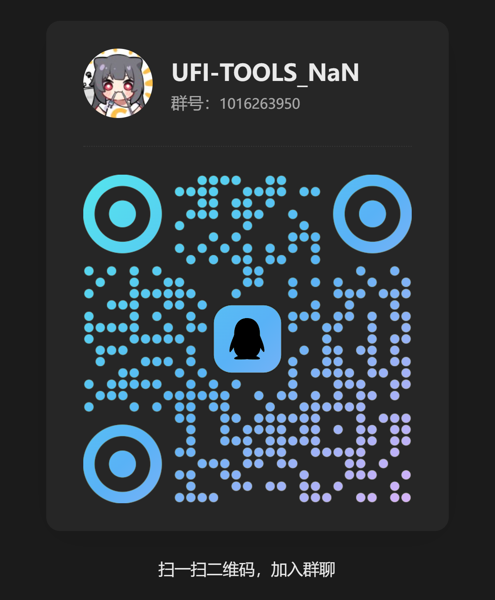
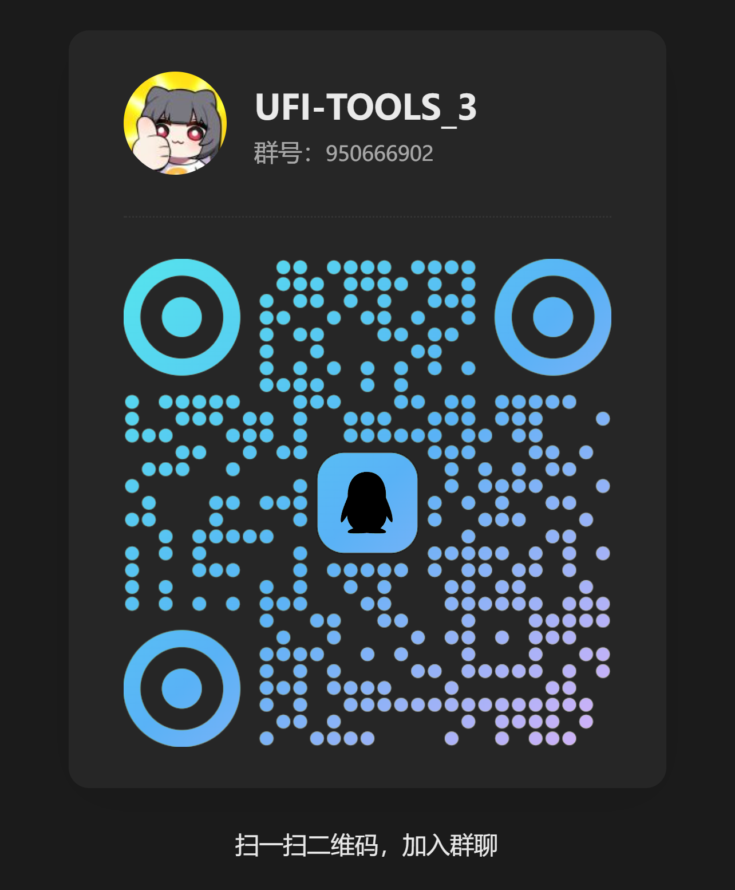

# 🧰 UFI-TOOLS

> A multi-functional management and extension tool for ZTE portable WiFi devices (F50/U30 Air)  
> Supports remote management, signal monitoring, system control, plugin extensions, and more  
> Also supports other ZTE Unisoc Android phones/tablets

**[UFI-TOOLS User Guide](https://github.com/kanoqwq/UFI-TOOLS/blob/http-server-version/User_Doc.md)**

F50 / U30Air universal installation tutorial: [📺 Video Tutorial](https://www.bilibili.com/video/BV1qUHpzeEDd)  
Magisk module version (ChangXing60 / Cloud PC) installation tutorial: [📺 Video Tutorial](https://www.bilibili.com/video/BV1nsW4zpE1T)

---

## Star History

<a href="https://www.star-history.com/?repos=kanoqwq%2FUFI-TOOLS&type=date&legend=top-left">
 <picture>
   <source media="(prefers-color-scheme: dark)" srcset="https://api.star-history.com/image?repos=kanoqwq/UFI-TOOLS&type=date&theme=dark&legend=top-left" />
   <source media="(prefers-color-scheme: light)" srcset="https://api.star-history.com/image?repos=kanoqwq/UFI-TOOLS&type=date&legend=top-left" />
   
 </picture>
</a>

---

## 🧩 Version Differences

UFI-TOOLS offers **Pocket Edition (PE)** and **Full Version** to meet different scenario requirements:

| Version | Deployment | Target Devices | Features | Typical Use |
|-----------|-----------|-----------|-----------|-----------|
| 📱 **[Pocket Edition (PE)](https://github.com/kanoqwq/UFI-TOOLS/tree/main)** | Install on phone only | Phone connects to MIFI/UFI device | ⭐ Simplified features 🚫 No need to install on portable WiFi ⚙️ Can remotely control portable WiFi | Phone controls portable WiFi, lightweight remote management |
| 💻 **[Full Version](https://github.com/kanoqwq/UFI-TOOLS/tree/http-server-version)** | Install on target device (portable WiFi / tablet / router) | Portable WiFi (U30 Air/F50, etc.) | 🌟 Full feature support 🧠 Complete plugin store 🔐 Can enable advanced features | Deep system management and plugin extensions, full device control |

> 💡 PE version is for casual users; Full version is for advanced users and enthusiasts.

> 💡 How to know if your device supports UFI-TOOLS?
>
> - As long as you have a ZTE portable WiFi with Unisoc platform and Android OS, you can try UFI-TOOLS for device management.
> - Download the PE version directly and try connecting to your device.

---

## 📘 Project Overview

**UFI-TOOLS** is an all-in-one system management and extension framework built for **ZTE + Unisoc platform devices**.  
Supports running on **portable routers, phones, tablets** and various devices, deployable via **Web UI / APK / Magisk Module**.

- ✅ Compatible devices: ZTE F50, U30 Air, ChangXing60, YuanHang60 series, ZTE Cloud PC tablet, etc.  
- 🧩 Modular plugin system  
- 🌐 Supports remote web control and device cluster management  
- ⚙️ Can run as background service with auto-start on boot  

---

## ⚙️ Core Features

### 🔧 System & Device Control
- One-click enable advanced features for highest system privileges (Root-level control)  
- **Performance mode switching / CPU core control / Battery charge limit**  
- **USB debug auto-enable** and **Network USB debug auto-start**  
- Supports **file sharing / LED control / OTA updates**  
- Supports **boot scripts and background services**  

---

### 📶 Network & Signal Management
- **Lock band / Lock cell without restart** (takes effect immediately)  
- Supports **3G / 4G / 5G network mode switching**  
- Real-time monitoring: RSRP, SINR, PCI, Band, QCI, SNR, QoS, IPv6 and other signal, band, rate indicators  
- **LAN speed test** with real-time rate chart visualization  

---

### 💬 Communication & Commands
- SMS send, receive and **auto-forward**  
- Built-in **AT command terminal** (supports custom command interaction)  
- Supports **remote SSH management** and command-line access (requires advanced features)  
- Provides lightweight **Web console**, supports LAN / tunneling remote control  

---

### 🧩 Plugin Store
UFI-TOOLS has a built-in **Plugin Store** for online download and installation of various plugins.  
The plugin server includes common components covering system extensions, AI, networking, automation and more:

| Category | Plugin Name | Description |
|------|-----------|-----------|
| 🛡️ System Security | ADGuardHome | Ad filtering, DNS management |
| 📊 Status Monitoring | Data Usage Card | Real-time device data usage and rate display |
| 🤖 Smart Apps | AI Dashboard | Smart monitoring information display |
| 🔑 Remote Access | SSH Tool | Provides remote command-line access |
| ⚙️ System Control | CPU Core Control | Dynamic core start/stop management |
| 🎨 Appearance | Theme Layout Editor | Custom interface themes and layout |
| 🔋 Power Management | Battery Charge Limit | Extend battery life, smart charge threshold control |
| 🏫 Network Support | EasyConnect | Campus VPN support |
| ⏰ Automation | Crontab Scheduler | Scheduled push and script tasks |
| 🌐 Remote Networking | EasyTier Mesh | Multi-device cross-region networking |

> 🔓 Plugin system is modular; above shows only partial plugins. More features will be added in the future.

---

### 🧠 Advanced Features
Enabling 'Advanced Features' unlocks system privileges:
- Obtain highest system privileges  
- Access hidden interfaces and low-level management modules  
- Unlock all plugin store plugins  
- Enable fast update channel (zero-wait updates)  
- Supports remote SSH access, file push, system-level debugging  

---

### 📱 Platform Compatibility
Supports the following devices and deployment methods:

- 📲 **Magisk Module Install** (suitable for phones/tablets)
- 💻 **One-click Install / Screen-cast Install** (recommended for portable WiFi)   

**Compatible Models:**

- ZTE ChangXing60 / YuanHang60 / ChangXing60Plus  
- ZTE Cloud PC Tablet (W200DS series)  
- F50、U30 Air  
- And other Unisoc CPU + ZTE MyOS 13 devices (theoretically compatible)  

---

### 🌐 Remote Management & Web Control
- Built-in lightweight Web Server, accessible via browser  
- Supports:
    - Device status cards  
    - Real-time performance monitoring  
    - Plugin store  
    - Network control and debugging  
- Default access URL: `http://device-IP:2333`  

---

## 🌟 Project Highlights
- 🧩 Modular design: core + plugin architecture, flexible extension  
- ⚡ Lock band/cell without restart: more efficient debugging  
- 📈 Real-time visual monitoring: signal, CPU, temperature, memory, speed  
- 🔐 Advanced features: one-click system privileges, exclusive functions for power users
- 🧠 Multi-platform support: phones / tablets / portable WiFi fully compatible  
- 🔄 Fast update mechanism: automatically stays up-to-date  
- 🖥️ Dual-platform control: browser supports both mobile and PC  
- ☁️ Cross-location networking: easily achieve remote connectivity via EasyTier  
- 🐱 Cat plugin: Smart internet access (requires additional configuration)  

---

## ⚠️ Notes
- Some features depend on specific device model or system version.  
- Some plugin store plugins require 'Advanced Features' to be enabled.  
- Before using advanced features, please backup important data.  
- Test environment:  
  `U30Air_SSVB14 / MU300_ZYV1.0.0B09 / ChangXing60 (Rooted) / ChangXing60Plus (Rooted) / YuanHang60 (Rooted) / Cloud PC Tablet (Rooted)`  

---

## 📜 Open Source License
This project follows the **MIT License**  
Free to use, modify, and distribute, but please retain author attribution.

Welcome to submit Issues / Pull Requests to help improve the project 💡  

> This project is completely open-source and free. If you like it, you can buy me a coffee~
>
> |  |  |
> | ------------------------------- | ------------------------------- |
>

> Welcome to join the group chat for discussion!
> TG：[t.me/ufi_tools_chat](https://github.com/kanoqwq/UFI-TOOLS/tree/http-server-version)
>
> |  |  |
> | ------------------------------- | ------------------------------- |
>

