# UFI-TOOLS User Manual

## Table of Contents

- [1. Introduction](#1-introduction)
  - [1.1 Software Overview](#11-software-overview)
  - [1.2 Software Positioning](#12-software-positioning)
  - [1.3 Compatible Devices](#13-compatible-devices)
  - [1.4 Deployment Methods and Usage](#14-deployment-methods-and-usage)
  - [1.5 Feature System Overview](#15-feature-system-overview)
  - [1.6 Typical Use Cases](#16-typical-use-cases)

- [2. Pre-Use Instructions](#2-pre-use-instructions)
  - [2.1 Usage Environment Requirements](#21-usage-environment-requirements)
  - [2.2 Pre-Installation Preparation](#22-pre-installation-preparation)
  - [2.3 Risk Notice and Disclaimer](#23-risk-notice-and-disclaimer)

- [3. Installation and First Use](#3-installation-and-first-use)
  - [3.1 Device-Side Installation Instructions](#31-device-side-installation-instructions)
  - [3.2 Connecting the Device Before Installation](#32-connecting-the-device-before-installation)
  - [3.3 Using the UFI-TOOLS One-Click Installer](#33-using-the-ufi-tools-one-click-installer)
  - [3.4 Manually Installing the APK to Device](#34-manually-installing-the-apk-to-device)
  - [3.5 First Launch](#35-first-launch)
  - [3.6 Basic Permissions and System Settings](#36-basic-permissions-and-system-settings)
  - [3.7 Backend Service Startup](#37-backend-service-startup)
  - [3.8 Login and Basic Access](#38-login-and-basic-access)

- [4. Main Interface Guide](#4-main-interface-guide)
  - [4.1 Page Layout](#41-page-layout)
  - [4.2 Feature List Area](#42-feature-list-area)
  - [4.3 Device Monitoring Area](#43-device-monitoring-area)
  - [4.4 Basic Status Area](#44-basic-status-area)
  - [4.5 Refresh and Field Management](#45-refresh-and-field-management)
  - [4.6 Multi-Language and Basic Options](#46-multi-language-and-basic-options)

- [5. Account and Basic Controls](#5-account-and-basic-controls)
  - [5.1 Login and Logout](#51-login-and-logout)
  - [5.2 Change Passcode](#52-change-passcode)
  - [5.3 Change Password](#53-change-password)
  - [5.4 Reboot Device](#54-reboot-device)
  - [5.5 Scheduled Reboot](#55-scheduled-reboot)
  - [5.6 Power Off](#56-power-off)

- [6. Status Monitoring and Device Information](#6-status-monitoring-and-device-information)
  - [6.1 Basic Status](#61-basic-status)
  - [6.2 Network Status](#62-network-status)
  - [6.3 Data Usage Statistics](#63-data-usage-statistics)
  - [6.4 Signal Parameters](#64-signal-parameters)
  - [6.5 Device Properties](#65-device-properties)
  - [6.6 CPU, Memory and Temperature](#66-cpu-memory-and-temperature)
  - [6.7 Battery and Power Information](#67-battery-and-power-information)

- [7. Network and Signal Management](#7-network-and-signal-management)
  - [7.1 Data Switch](#71-data-switch)
  - [7.2 Network Mode Switching](#72-network-mode-switching)
  - [7.3 Band Locking](#73-band-locking)
  - [7.4 Cell Locking](#74-cell-locking)
  - [7.5 APN Settings](#75-apn-settings)
  - [7.6 Network Roaming](#76-network-roaming)
  - [7.7 LAN Speed Test](#77-lan-speed-test)
  - [7.8 Data Speed Test](#78-data-speed-test)

- [8. Communication and Debugging Features](#8-communication-and-debugging-features)
  - [8.1 SMS Send/Receive](#81-sms-sendreceive)
  - [8.2 SMS Forwarding and Device Info Notifications](#82-sms-forwarding-and-device-info-notifications)
  - [8.3 AT Commands](#83-at-commands)
  - [8.4 USB Debugging](#84-usb-debugging)
  - [8.5 Network ADB Auto-Start](#85-network-adb-auto-start)
  - [8.6 TTYD Terminal](#86-ttyd-terminal)

- [9. System and Device Controls](#9-system-and-device-controls)
  - [9.1 Performance Mode](#91-performance-mode)
  - [9.2 LED Indicator Control](#92-led-indicator-control)
  - [9.3 NFC Control](#93-nfc-control)
  - [9.4 File Sharing (SMB)](#94-file-sharing-smb)
  - [9.5 Sleep Timer Settings](#95-sleep-timer-settings)
  - [9.6 SIM Card Switching](#96-sim-card-switching)
  - [9.7 USB Tethering Mode](#97-usb-tethering-mode)
  - [9.8 USB Status View](#98-usb-status-view)

- [10. Local Network and Access Management](#10-local-network-and-access-management)
  - [10.1 WiFi Settings](#101-wifi-settings)
  - [10.2 LAN Settings](#102-lan-settings)
  - [10.3 DHCP Settings](#103-dhcp-settings)
  - [10.4 Connected Device Management](#104-connected-device-management)

- [11. Data Usage and Automation Features](#11-data-usage-and-automation-features)
  - [11.1 Data Usage Management](#111-data-usage-management)
  - [11.2 Scheduled Tasks](#112-scheduled-tasks)
  - [11.3 Automated Action Descriptions](#113-automated-action-descriptions)
  - [11.4 Boot Scripts and Scheduled Scripts](#114-boot-scripts-and-scheduled-scripts)

- [12. Advanced Features](#12-advanced-features)
  - [12.1 Advanced Features Introduction](#121-advanced-features-introduction)
  - [12.2 Activation Requirements](#122-activation-requirements)
  - [12.3 Feature Content](#123-feature-content)
  - [12.4 Usage Precautions](#124-usage-precautions)

- [13. Plugins and UI Customization](#13-plugins-and-ui-customization)
  - [13.1 Plugin System Overview](#131-plugin-system-overview)
  - [13.2 Plugin Add, Edit and Toggle](#132-plugin-add-edit-and-toggle)
  - [13.3 Plugin Store](#133-plugin-store)
  - [13.4 Plugin Import and Export](#134-plugin-import-and-export)
  - [13.5 Theme and Background Settings](#135-theme-and-background-settings)
  - [13.6 Uploaded File Management](#136-uploaded-file-management)

- [14. Software Updates and Remote Access](#14-software-updates-and-remote-access)
  - [14.1 Software Updates](#141-software-updates)
  - [14.2 Remote Access to UFI-TOOLS](#142-remote-access-to-ufi-tools)

- [15. FAQ and Troubleshooting](#15-faq-and-troubleshooting)
  - [15.1 Cannot Access Backend](#151-cannot-access-backend)
  - [15.2 Cannot Login or Authentication Failure](#152-cannot-login-or-authentication-failure)
  - [15.3 Some Features Unavailable](#153-some-features-unavailable)
  - [15.4 Advanced Features Malfunction](#154-advanced-features-malfunction)

- [16. Appendix](#16-appendix)
  - [16.1 Common Terminology](#161-common-terminology)
  - [16.2 Default Addresses and Ports](#162-default-addresses-and-ports)
  - [16.3 Reference Links](#163-reference-links)

## 1. Introduction

### 1.1 Software Overview

> **UFI-TOOLS is an enhanced comprehensive management backend designed for ZTE T760 series UFI/MiFi portable WiFi devices. Building upon the device's native Web backend capabilities, it provides more complete status monitoring, more flexible network debugging, richer system control capabilities, and plugin extensions and advanced management features for power users.**
> **Compared to traditional device backends that only cover basic connectivity configuration, UFI-TOOLS emphasizes "observable, controllable, and extensible." Users can not only perform daily connectivity management but also perform unified operations around signal, data usage, SMS, debugging, automated tasks, plugins, and remote maintenance needs.**

### 1.2 Software Positioning

UFI-TOOLS is not positioned as merely a "beautified backend" or "auxiliary tool," but rather as an enhanced all-in-one management backend built around portable WiFi devices, primarily addressing the following types of needs:

- Replacing or supplementing feature entries in the original factory backend that are not intuitive, centralized, or open enough
- Providing more detailed device status, network status, and data usage displays for daily use
- Providing advanced users with network debugging capabilities such as band locking, cell locking, AT commands, APN adjustment, USB debugging, and wireless ADB auto-start
- Providing maintenance capabilities for long-running scenarios including SMS forwarding, scheduled tasks, scheduled reboots, remote access, and TTYD
- Extending device capabilities through advanced features and plugin system, making the device more customizable

Therefore, UFI-TOOLS can serve as a convenient management backend for regular users, as well as a debugging and maintenance platform for advanced users.

### 1.3 Compatible Devices

UFI-TOOLS is primarily designed around the ZTE T760 series and similar platform devices, with priority adaptation for common ZTE portable WiFi devices. Based on project documentation, interface information, and current repository content, adapted or primarily targeted devices include but are not limited to:

- F50
- U30 Air
- V50
- U20 (F50 firmware variant)
- M3 (some firmware versions)
- Changxing 60 series
- Cloud PC W200DS series

Available features may vary across different device models, firmware versions, and system permission states. Some features depend on one or more of the following conditions being met:

- The device itself provides the corresponding interface
- The current firmware version supports the relevant calls
- USB debugging or network ADB has been enabled
- Advanced features have been enabled
- The software has been deployed to the target device itself

Therefore, features mentioned in this manual do not mean all devices can fully use them. Actual availability should be based on the current device model and firmware environment.

### 1.4 Deployment Methods and Usage

UFI-TOOLS supports multiple deployment and usage methods, suitable for different user scenarios:

- Phone-side usage: Install the software on a phone, manage by connecting to the portable WiFi device. Suitable for lightweight use and initial access
- Device-side usage: Install the software directly on the portable WiFi device itself to get more complete backend capabilities and higher feature availability. Devices under the hotspot can access the UFI-TOOLS backend page through a browser for centralized management

Feature completeness is not identical across different deployment methods. Typically, deploying the software on the target device itself provides the most complete features, especially those involving backend services, automated tasks, advanced features, plugin system, and system-level controls.
This manual primarily describes the device-side usage scenario, and we recommend users install UFI-TOOLS on the device side.

### 1.5 Feature System Overview

The UFI-TOOLS feature system can be summarized as follows:

- Basic access and control: Login/logout, change passcode, change password, reboot device, scheduled reboot, power off
- Status monitoring: Device basic status, network status, data usage statistics, signal parameters, CPU usage, CPU frequency, memory usage, temperature, battery status, USB status
- Network and signal management: Data switch, network mode switching, band locking, cell locking, APN settings, network roaming, LAN speed test, data speed test
- Communication and debugging: SMS send/receive, SMS forwarding, AT commands, USB debugging, network ADB auto-start, TTYD terminal
- System controls: Performance mode, LED indicators, NFC, file sharing, sleep timer, SIM card switching, USB tethering mode
- Local network management: WiFi settings, LAN settings, DHCP settings, connected device management, blacklist management
- Automation features: Data usage management, scheduled tasks, automated action execution, scheduled reboot, boot script capabilities
- Advanced capabilities: Advanced features toggle, Root Shell capabilities, TTYD port, system-level extensions
- Extensions and customization: Plugin add, edit, toggle, plugin store, theme/background settings, uploaded file management
- Operations capabilities: Software updates, LAN access, remote access, long-term online maintenance

This means UFI-TOOLS covers far more than just "viewing device status" or "changing a few network parameters" - it forms a complete management system around device operation, connectivity, maintenance, automation, and extended usage.
*Some features are subject to the current device model and firmware environment

### 1.6 Typical Use Cases

UFI-TOOLS is suitable for the following common scenarios:

- Daily viewing of device connectivity status, data usage, signal quality, and operating status
- Switching network modes, locking bands, or locking cells based on usage environment to improve stability or speed
- Remotely receiving SMS verification codes with automatic forwarding via email, Webhook, DingTalk, or other methods
- Using scheduled tasks for automatic reboots, automatic network switching, automatic WiFi toggling, automatic band/cell unlocking, or performing maintenance actions
- Using AT commands, USB debugging, network ADB, or TTYD for further debugging or device maintenance
- Extending backend capabilities and customizing the UI through the plugin system and theme features

For regular users, UFI-TOOLS can serve as an easier-to-use management backend with more complete information. For advanced users, it also provides sufficient interfaces and feature entries for device optimization, remote operations, and capability extension.

## 2. Pre-Use Instructions

### 2.1 Usage Environment Requirements

Before using UFI-TOOLS, it is recommended to confirm that the current device and usage environment meet the following basic conditions:

- Target device is a ZTE T760 series or similar platform UFI/MiFi portable WiFi device, or a verified compatible model
- Device can boot normally, connect to the network, and access the original factory backend
- User has the basic ability to access the device management page via a browser
- Conditions exist to install UFI-TOOLS on the target device itself (USB debugging or network ADB debugging enabled)
- Other conditions that allow UFI-TOOLS to be properly installed on the device

Recommended usage environment:

- A stable LAN environment, ensuring phones, computers, and portable WiFi devices can access each other
- During initial installation or when enabling certain features, ADB or other basic debugging tools are available
- When using remote access, SMS forwarding, plugin store, software updates and similar features, a usable network connection is available

Notes:

- Feature support scope varies across different models and firmware versions
- Some features require advanced features to be enabled before they can be used

### 2.2 Pre-Installation Preparation

To ensure a smooth installation and first-use process, the following preparations are recommended before installation:

1. Confirm device information  
   It is recommended to first confirm the target device model, system version, firmware version, and whether the original factory backend can be accessed normally. If the device itself has issues, cannot connect to the network, or the system is unstable, restore basic device functionality before installing UFI-TOOLS.

2. Prepare access and debugging conditions  
   If planning to install the software on the portable WiFi device, you typically need to prepare one of the following conditions in advance:

- Device debugging (USB debugging) has been enabled
- Can connect to the device via USB ADB
- Or can connect to the device via network ADB

3. Back up important data  
   Before performing installation, upgrades, enabling advanced features, modifying network parameters, installing plugins, or similar operations, it is recommended to back up the following:

- Current network configuration
- APN configuration
- WiFi name and password
- Important plugin configurations
- Important files or scripts on the device

4. Keep device power supply stable  
   When installing software, performing OTA updates, adding advanced features, or making other system-level modifications, ensure the device has sufficient battery or is connected to a stable power source to avoid installation failure, configuration corruption, or system anomalies due to power loss.

5. Avoid unnecessary interference  
   During initial deployment and debugging, try to avoid the following situations:

- Frequently switching network environments
- Actively rebooting the device during installation
- Using multiple tools to repeatedly modify the same system setting simultaneously
- Installing too many plugins without confirming compatibility

### 2.3 Risk Notice and Disclaimer

> UFI-TOOLS is a tool designed for enhanced device management and advanced maintenance scenarios. Some features involve changes to device system settings, network parameters, debugging interfaces, or extension capabilities, so related risks should be fully understood before use.

Please pay special attention to the following:

- Operations such as band locking, cell locking, network mode switching, and APN modification may cause the device to temporarily lose signal, fail to register on the network, or experience degraded network performance
- Operations such as enabling USB debugging, network ADB, TTYD, and advanced features will increase device operability while also creating additional security exposure
- Software updates, plugin installation, system-level configuration changes, or advanced feature execution may result in feature failure, configuration loss, or device anomalies due to model differences, firmware differences, or environment issues
- Features such as scheduled tasks, SMS forwarding, and automated action execution, if improperly configured, may cause misoperation, repeated execution, or additional network and battery consumption
- Some third-party plugins may affect device performance, stability, or compatibility. Assess risks independently before installation
- When using AT commands, ensure the commands you enter are correct. Additionally, users with embedded SIM cards or IoT cards should avoid arbitrarily changing the device IMEI during use

Recommended usage principles:

- When first starting out, begin with basic features. It is not recommended to enable all advanced capabilities at once
- Modifications to network parameters, debugging interfaces, and advanced features should be done and verified one at a time
- For long-running features such as SMS forwarding, scheduled tasks, and remote access, test in a controlled environment before putting into production
- If the current device handles important communication tasks, avoid making high-risk setting changes during critical usage periods

Disclaimer:

**UFI-TOOLS is an open-source tool provided as-is, with no guarantee of suitability for all models, all firmware versions, or all usage scenarios. The user assumes all risks and responsibilities for any device anomalies, data loss, configuration corruption, connectivity failures, performance degradation, or other direct or indirect losses caused by using this software.**

If you are uncertain about the meaning, impact scope, or recovery methods of certain operations, it is recommended to complete firmware and data backups before proceeding, and fully understand the corresponding features before use.

## 3. Installation and First Use

Reference tutorials:
**UFI-TOOLS Universal Installation Tutorial: [Video on Bilibili](https://www.bilibili.com/video/BV1qUHpzeEDd)**  
**Magisk Module Version (Changxing 60 / Cloud PC) Installation Tutorial: [Video on Bilibili](https://www.bilibili.com/video/BV1nsW4zpE1T)**

### 3.1 Device-Side Installation Instructions

> The rest of this manual defaults to "device-side installation" as the standard usage scenario, meaning UFI-TOOLS is installed directly on the portable WiFi device itself, then accessed via browser through its Web management backend.

This is currently the most recommended deployment method for the following reasons:

- Highest feature completeness
- More accurate status monitoring and system control
- Easier to enable backend services, automated tasks, and advanced features
- More suitable for long-term operation and subsequent maintenance

Therefore, except for temporary testing, it is recommended to deploy UFI-TOOLS on the target device itself rather than only using external devices for auxiliary control.

### 3.2 Connecting the Device Before Installation

> Before installing UFI-TOOLS on the device, you need to first establish an operable connection to the target device.

Recommended procedure:

1. Connect your computer or phone to the target portable WiFi's network.  
2. Open the device's original factory backend and confirm that the device's connectivity and management page access are normal.  
3. Enable debugging-related entries in the factory backend, such as ADB or USB debugging.  
4. Use ADB tools to establish a connection with the device.  

Notes:

- If the device supports USB wired debugging, USB ADB wired debugging is preferred
- If the device supports network debugging, network ADB can also be used
- If you need to remotely operate the device interface after installation, you can use tools like Scrcpy

If the current device cannot enable the debugging entry or cannot establish an ADB connection, troubleshoot the factory backend settings, connection cable, drivers, network connectivity, and firmware compatibility before continuing installation.
If the current firmware cannot enable ADB, consider rooting the device directly or downgrading the firmware to a compatible version.

### 3.3 Using the UFI-TOOLS One-Click Installer

> For most users, it is recommended to use the `UFI-TOOLS One-Click Installer` for device-side deployment.  
> Compared to manual ADB installation, the one-click installer is typically more suitable for users encountering this type of device for the first time, with a more centralized operation flow and fewer opportunities for intermediate steps to go wrong.

Recommended procedure:

1. Prepare the `UFI-TOOLS One-Click Installer` and the corresponding installation package on your computer.  
2. Following the tutorial, connect the target device to the computer via USB cable, and use a browser to access the device's official backend. Confirm it is accessible before proceeding.
3. Open the installer. It will automatically enable the device's USB debugging and perform installation deployment.
4. After installation is complete, connect to the WiFi and use a browser to access the UFI-TOOLS backend to confirm successful deployment.  

The one-click installer is suitable for the following scenarios:

- Users who want to minimize manual ADB command input
- Users installing a device-side backend for the first time
- Users who want to complete the standard deployment process faster

When using the one-click installer, the following precautions should still be noted:

- Confirm the device can boot normally and access the factory backend before installation
- Avoid power loss, disconnection, or frequent network switching during installation
- If the installer fails to recognize the device, check the device debugging status, connection method, and driver environment first
- If automatic installation fails, you can switch to manual ADB installation to continue deployment

If your firmware is special, you can try using aaadddbbb.exe to temporarily enable wireless ADB, then continue using the one-click installer for the rest of the installation process.

Required tool download address: https://pan.kanokano.cn/UFI-TOOLS-UPDATE/UFI-TOOLS%E4%B8%80%E9%94%AE%E5%AE%89%E8%A3%85%E5%99%A8

### 3.4 Manually Installing the APK to Device

> When the one-click installer is unavailable or you need to manually troubleshoot installation issues, the traditional ADB installation method can also be used.

Recommended procedure:

1. Prepare the UFI-TOOLS APK installation package.  
2. Confirm ADB has correctly identified the target device.  
3. Install the APK to the target device via ADB.  
4. After installation, find UFI-TOOLS in the device's application list and launch it.  
5. Set up the app's background permissions and auto-start permissions to ensure complete authorization.

Manual installation is more suitable for the following scenarios:

- Need to control the installation process yourself
- Need to troubleshoot issues where the installer cannot recognize or deploy
- Need to handle special device environments individually

Precautions during installation:

- If an older version already exists on the device, confirm whether an overlay installation is needed
- If installation fails, check ADB connection status, device storage space, and whether the system is blocking installation
- If operating the device via screen mirroring, keep the connection stable to avoid interruptions during installation

> **If none of the above methods work for installation, consider rooting the device and flashing a root package with USB debugging pre-enabled to forcefully enable ADB.**

### 3.5 First Launch

> After first launching UFI-TOOLS on the device, it is recommended to complete basic initialization confirmation rather than immediately modifying many settings.

On first launch, confirm the following:

- The application opens normally without crashes or obvious anomalies
- Current device model and operating environment are correctly identified
- Backend service has normal startup conditions
- Can properly distinguish between UFI backend passcode and official backend password

According to current project documentation, the following basic operations are typically needed after first launch:

1. Confirm gateway address  
   The gateway address is typically the device's current LAN access address, e.g., `192.168.0.1`. The actual address should be based on the current device network environment.

2. Modify or confirm backend passcode  
   UFI-TOOLS backend login requires an independent passcode. If still using the default simple passcode, the system will display a weak passcode modification prompt. It is recommended to change it as soon as possible during initial deployment.

3. Prepare to start backend service  
   Confirm the service startup entry is available in the application and observe whether the subsequent Web service can run normally.

### 3.6 Basic Permissions and System Settings

> To ensure stable backend operation, the following system settings should be completed as soon as possible after initial installation:

1. Disable battery optimization  
   If the system enables battery optimization for UFI-TOOLS, it may cause the backend service to be reclaimed by the system, affecting web access, automated tasks, SMS forwarding, and boot auto-start.

2. Enable notification permissions  
   UFI-TOOLS' backend service relies on the foreground service mechanism to run. If notification permissions are not enabled, some systems may affect service stability.

3. Check background running permissions  
   If the system provides restrictions such as auto-start, background keep-alive, or background freeze options, grant UFI-TOOLS permission for continued operation.

*If the user installed using the `UFI-TOOLS One-Click Installer` with the advanced backend, the above permissions do not need manual configuration as the installer will automatically grant them.*

4. Confirm debugging capabilities as needed  
   If you later need to use software updates, network ADB, custom debugging, etc., confirm whether USB debugging and network ADB conditions are met, or directly enable advanced features.

After completing these settings, verify that the backend service can run stably before proceeding with further network, SMS, or plugin configuration.

### 3.7 Backend Service Startup

> UFI-TOOLS' Web management backend can only be accessed after the device-side service is started, making service startup a critical step in the entire deployment process.

Based on the current project implementation, after installation via the installer, the service starts automatically. The default backend port is:

`2333`

The common access format is:

`http://Device-Gateway-IP:2333`

For example:

`http://192.168.0.1:2333`

Notes:

- If the device gateway address has been modified, use the actual gateway address
- If the service fails to start, check gateway settings, permission status, and background running restrictions first
- If the port is inaccessible, also check whether the current device and access terminal are on the same network

### 3.8 Login and Basic Access

> After the backend service starts successfully, you can access the UFI-TOOLS management backend via a browser.

Recommended access procedure:

1. Use a computer, phone, or tablet on the same network as the device to open a browser.  
2. Enter the current device access address, e.g., `http://192.168.0.1:2333`.  
3. After the login page opens, enter the login information as prompted.  

Based on the current frontend interface, login typically requires the following information:

- UFI-TOOLS backend passcode
- Device official backend management password

> Because some UFI-TOOLS features directly rely on the official backend's API, these features require the device's official backend management password.
> Users may initially find two password fields confusing, but this is actually a security hardening measure that aligns with the software's design goals.

Additional notes:

- The official backend management password can usually be found on the label on the back of the device
- If the login page provides multiple login methods, use the default method first; if verification fails, try switching to another method
- If the page cannot refresh after login or some features are unavailable, check the gateway address, passcode, official backend password, and current firmware compatibility first

After first successful login, complete the following verification:

- Check that the homepage normally displays "Device Monitoring" and "Basic Status"
- Try manually refreshing data to confirm backend communication is normal
- Confirm the page continues to update and doesn't briefly display then become unresponsive
- Confirm login status is stable before continuing to configure further features

## 4. Main Interface Guide

### 4.1 Page Layout

> The UFI-TOOLS main interface uses a modular layout. After successful login, users will see the following main areas:

| Category | Content |
| -------- | ------- |
| Page structure | Top title area, feature list area, feature module expansion area |
| Information display | Device monitoring area, basic status area |

The overall design philosophy is to centrally display "commonly used operation entries" and "real-time status information," allowing users to view, assess, and operate on the same page without frequently switching pages.


### 4.2 Feature List Area

> The feature list area is located at the top of the main interface and is the backend's primary operation entry area. Users can quickly access common features or directly perform some quick operations here.

This area includes the following content:

| Category | Content |
| -------- | ------- |
| Account & Security | Login/Logout, Change Passcode, Change Password |
| Power Management | Reboot Device, Scheduled Reboot, Power Off |
| System & Interface | Theme/Background, Plugin Features, Performance Mode, LED Indicators |
| Network Features | Data Usage Management, LAN Speed Test, Data Speed Test, Network Roaming, APN Settings |
| Communication | SMS Send/Receive, SMS Forwarding |
| Device & Connection | Connected Devices, WiFi Settings, LAN Settings, USB Status |
| Development & Advanced | AT Commands, Advanced Features, USB Debugging, ADB Auto-Start |
| Data & Services | Data Switch, File Sharing, Scheduled Tasks, NFC |
| System Maintenance | Software Update |

Additionally, the feature list area integrates several quick dropdown options, such as:

| Category | Content |
| -------- | ------- |
| System Settings | Sleep Timer Settings, Language Switch |
| Network Settings | Network Mode Switch, USB Tethering Mode Switch, SIM Card Switch |

The feature list area supports collapsing and expanding. For devices with smaller screens, collapse as needed to leave more space for the status monitoring and parameter display areas.

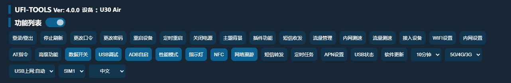

### 4.3 Device Monitoring Area

> The device monitoring area displays dynamic chart information during device operation and is an important area for users to observe real-time device status.

The device monitoring area includes the following:

| Category | Content |
| -------- | ------- |
| CPU-related | CPU usage chart, CPU core usage chart, CPU frequency, CPU temperature chart |
| System resources | Memory usage chart |
| Network | Current network speed chart |

This area is mainly used to help users quickly determine whether the device is experiencing the following situations:

| Category | Content |
| -------- | ------- |
| CPU anomaly | CPU load too high, core abnormally maxed out |
| Memory | Memory usage too high |
| Temperature | Device temperature abnormally elevated |
| Network | Significant network throughput changes |

This area is more suitable for "trend observation" rather than just looking at a single instantaneous value.  
If the user is performing speed tests, running plugins, or high-load operations, prioritize observing changes in this area.


### 4.4 Basic Status Area

> The basic status area centrally displays the device's current main status parameters and is one of the most information-dense areas on the backend homepage.

This area is divided into several information sections, such as:

- Basic Status
- Signal Parameters
- Device Properties

Content that may be displayed includes but is not limited to:

| Category | Content |
| -------- | ------- |
| Status | QCI & Speed, Network Status, WiFi Count, Connection Duration |
| Performance | CPU Temperature, CPU Usage, Memory Usage |
| Battery | Battery Level & Charging, Current & Voltage |
| Network | Signal Strength, Upload/Download Speed, 5G/4G Parameters, Band/PCI etc. |
| Device | Client IP, Device Model, Firmware Version, Local Gateway, IMEI/IMSI |
| Storage | Internal Storage and SD Card Status |
| Data Usage | Used Data, Today's Data, Monthly Data |

This area is suitable for users in the following scenarios:

- Quickly confirming whether the device is currently online
- Determining whether current network quality is normal
- Observing data usage
- Troubleshooting device overheating, load, or power supply issues
- Checking device model, version, and local network information


### 4.5 Refresh and Field Management

> Status information on the main interface supports automatic refresh. To balance real-time responsiveness and device load, the backend provides refresh control and field management features.

Common related operations include:

- Stop refresh
- Select refresh frequency
- Manage fields

Where:

- "Stop refresh" temporarily stops automatic page updates. Suitable when viewing certain instantaneous parameters, copying information, or performing band/cell locking operations
- "Refresh frequency" adjusts the status update speed. Faster refresh means more real-time page data but may also increase device load
- "Manage fields" controls which fields are displayed in the basic status area. Suitable for streamlining page content according to personal needs

Recommendations:

- For daily use, a medium refresh frequency (1s) is recommended
- When observing signals, testing speed, or troubleshooting, temporarily increase the refresh frequency
- When you need to select cells in a stable manner, copy parameters, or take screenshots, stop the refresh first


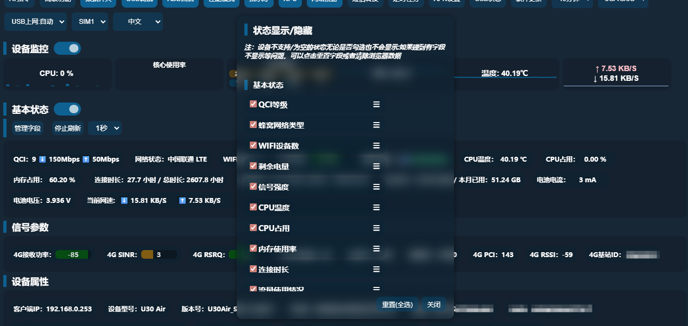

### 4.6 Multi-Language and Basic Options

> The main interface also provides several basic options for quickly adjusting device operation and interface language.

Visible basic options mainly include:

- Language switch
- Network mode switch
- USB tethering mode switch
- SIM card switch
- Sleep timer settings

These options exist as top dropdown menus for users to quickly modify common configurations.

Where:

- Language switch is used to change the backend interface display language
- Network mode switch is used to adjust between 3G/4G/5G modes
- USB tethering mode switch is used to set the USB network output method
- SIM card switch is used to switch the current card slot or corresponding carrier
- Sleep timer settings control the device's sleep timeout strategy

After performing these operations, observe whether the "Basic Status Area" feedback has been updated to confirm the settings have taken effect.

## 5. Account and Basic Controls

### 5.1 Login and Logout

> The UFI-TOOLS backend login entry is located in the feature list area, displayed as the "Login/Logout" button. On first accessing the backend, the system will display a login window requiring authentication information.

Login requires the following two items:

- UFI-TOOLS login passcode
- Device official backend management password

Where:

- The UFI-TOOLS login passcode is used to log into the current advanced backend
- The official backend management password is used to call device factory interfaces, and can be found on the label on the back of the device

Two login methods are also provided:

- Login Method 1
- Login Method 2

It is generally recommended to use the default method first. If you encounter password errors, login anomalies, or compatibility issues, switch to the other method and try again.

Additional notes:

- Login Method 1 has better performance and more stable login status
- Login Method 2 has stronger compatibility but may have login session time limits

To log out of the current session, click the "Login/Logout" button again to perform the logout operation.


### 5.2 Change Passcode

> "Change Passcode" is used to modify UFI-TOOLS backend's own login passcode.  
> This passcode is different from the device's original factory backend password and is UFI-TOOLS' independent access credential.

When using this feature, note the following:

- The default simple passcode is only suitable for initial deployment verification and is not recommended for long-term use
- It is recommended to change to a more complex and harder-to-guess passcode as soon as possible
- After modification, you will need to use the new passcode for subsequent backend logins

Operation procedure:

1. Log into the backend.  
2. Click "Change Passcode."  
3. Enter the new passcode.  
4. Enter the passcode again for confirmation.  
5. Submit and wait for the system to save. After submission, a popup will confirm the password entered and prompt the user to take a screenshot for safekeeping.  

Recommendations:

- The new passcode should not be identical to the device's default management password
- After modification, it is recommended to immediately log in again to confirm the new passcode is in effect


### 5.3 Change Password

> "Change Password" is used to modify the device's original factory Web backend management password.  
> This feature corresponds to the device's own backend authentication password, not the UFI-TOOLS login passcode.

Before using this feature, be clear about the following:

- What is being modified is the device's original factory backend password
- After successful modification, you will also need to enter the new factory backend password when logging into UFI-TOOLS
- If this password is forgotten, it may affect original factory backend access and some interface calls

It is recommended to use this feature in the following situations:

- The device is still using the factory default password
- The device is exposed to LAN or remote access environments for extended periods
- Need to improve overall backend access security

After modification, record the new password and re-verify the following:

- Whether the original factory backend can log in normally
- Whether UFI-TOOLS can still log in and function normally


### 5.4 Reboot Device

> "Reboot Device" is used to perform a full device reboot.  
> This feature is suitable for making certain configuration changes take effect, or attempting recovery when the device is running abnormally.

The reboot operation has a multi-click confirmation mechanism to prevent accidental triggers.  
The user needs to click multiple times consecutively before the system actually performs the reboot.

Suitable scenarios for using the reboot feature:

- Certain network settings require a reboot to take effect
- The device has been running too long and needs to reinitialize its state
- Some abnormal features may recover after a reboot
- A reboot is needed to verify software installation, upgrades, or system-level adjustments

Notes:

- During the reboot process, the device will briefly lose network connectivity
- All web access depending on the current connection will be interrupted
- If the device handles important connectivity tasks, choose an appropriate time to execute

### 5.5 Scheduled Reboot

> "Scheduled Reboot" is used to set the device to automatically reboot at a fixed time every day.  
> This feature is suitable for long-running scenarios such as continuous online operation, long-term power connection, and periodic network state refresh.

Scheduled reboot includes the following configuration items:

- Whether to enable daily scheduled reboot
- Daily reboot time

Recommended operation procedure:

1. Open the "Scheduled Reboot" settings window.  
2. Choose whether to enable.  
3. Enter the daily reboot time, e.g., `00:00`.  
4. Submit and save.  

Usage recommendations:

- It is recommended to set the reboot time during low-usage periods
- If the device is used for remote monitoring, avoid peak business hours
- If the time format is incorrect, the system will not save it

Common uses for scheduled reboot include:

- Daily maintenance of long-running devices
- Periodic network state refresh
- Reducing the probability of anomalies after extended operation


### 5.6 Power Off

> "Power Off" is used to execute a device shutdown.  
> Unlike "Reboot Device," after powering off, the device will not automatically resume operation and requires manual restart or re-powering.

The shutdown feature also has a confirmation mechanism to prevent accidental triggers causing the device to go offline directly.

Suitable scenarios for using the power off feature:

- Need to completely stop device operation
- Need to disconnect and maintain on-site equipment
- Certain device models support software-controlled shutdown

Notes:

- Not all models fully support software shutdown
- After shutdown, the backend webpage will immediately lose connection
- If the device is in a remote environment, confirm that on-site restart conditions exist before executing shutdown

Therefore, use the "Power Off" feature with extreme caution in remote environments to avoid the device becoming unrecoverable after shutdown.

## 6. Status Monitoring and Device Information

### 6.1 Basic Status

> The "Basic Status" area summarizes and displays the device's most core operational information, suitable for users to check immediately upon entering the backend.

Commonly visible content includes:

- Network Status
- WiFi Connection Count
- Battery Level and Charging Status
- Signal Strength
- CPU Temperature
- CPU Usage
- Memory Usage
- Connection Duration
- Used Data
- Today's Data
- Monthly Used Data
- Battery Current and Voltage
- Current Speed

This area is suitable for quickly assessing the following:

- Whether the device is normally connected to the network
- Whether the current network is stable
- Whether there is overheating or high load
- Whether data usage is growing abnormally
- Whether currently in charging state

For daily use, it is recommended to prioritize "Network Status," "Signal Strength," "Current Speed," "CPU Temperature," and "Used Data."

### 6.2 Network Status

"Network Status" displays the type of cellular network the device is currently connected to and its operational state, such as:

- Whether currently connected to a carrier network
- Whether currently on 3G, 4G, 5G, or other state
- Whether the network is normally registered

In daily observation:

- If a normal carrier name and network type are displayed, the device has successfully connected to the network
- If network status is abnormal, blank, or unchanged for a long time, check SIM card, signal, APN, network mode, or cell connection first

Additionally, the "WiFi Connection" field helps users understand how many terminal devices are currently connected to the device's hotspot.  
If the connection count is abnormally high, it may also affect device load and network experience.

### 6.3 Data Usage Statistics

Data usage statistics help users understand device usage. The backend displays the following types of information:

- Used Data
- Total Data
- Today's Data
- Monthly Used Data
- Current Speed

This data is suitable for the following scenarios:

- Checking whether approaching plan limits
- Determining whether there is abnormal data consumption
- Understanding usage intensity over a period
- Combined with data management features for alerts and controls

Where:

- "Used Data/Total Data" represents monthly statistics and cumulative statistics, with data sourced from the factory backend
- "Today's Data" is suitable for observing current day usage, sourced from Android's built-in data statistics
- "Monthly Used Data" is suitable for matching carrier plan billing cycles, sourced from Android's built-in data statistics, which is more accurate than the factory backend
- "Current Speed" displays real-time upload/download speeds, more suitable for observing instantaneous changes

If users notice abnormal data growth, it is recommended to investigate "Connected Devices," "Plugin operation status," and "Current Speed" together.


### 6.4 Signal Parameters

> The "Signal Parameters" area displays the device's current wireless signal quality and cell-related information when connected to a network.  
> This is one of the most important data sources for network optimization, band locking, cell locking, and troubleshooting.

Based on the current backend display, common signal parameters include:

| Category | Content |
| -------- | ------- |
| 4G Signal Parameters | Received Power (RSRP), SINR, Registered Band, Frequency, Bandwidth, PCI, RSRQ, RSSI, Cell ID |
| 5G Signal Parameters | Received Power (RSRP), SINR, Registered Band, Frequency, Bandwidth, PCI, RSRQ, RSSI, Cell ID |

When reading these parameters, focus on the following:

- RSRP mainly reflects received power strength
- SINR mainly reflects signal quality and interference
- RSRQ helps assess current link quality
- Band, frequency, PCI, and Cell ID can be used for band/cell locking operations and problem identification

Generally:

- Stronger received power means better basic coverage
- Higher SINR means better link quality
- If signal power is acceptable but speed is poor, focus on SINR, RSRQ, current band, and cell status

This area is recommended to be read in conjunction with Chapter 7 "Network and Signal Management" for simultaneous observation and optimization.

### 6.5 Device Properties

> The "Device Properties" area displays the device's identification information, version information, and local network information.  
> Compared to "Basic Status" and "Signal Parameters," this data changes less frequently and is more suitable for confirming device identity, system version, and environment information.

Based on the current backend, device properties commonly include:

| Category | Content |
| -------- | ------- |
| Network Info | Client IP, IPv6 Address, Local Gateway, MAC Address |
| Device Info | Device Model, Version Number |
| Identity Info | Phone Number, ICCID, IMEI, IMSI |
| Storage Info | Internal Storage, SD Card |

This information is mainly applicable to the following scenarios:

- Confirming whether the currently logged-in device is the target device
- Viewing the current firmware or software version
- Troubleshooting whether local network addresses are correct
- Confirming whether an IPv6 address has been assigned
- Checking remaining internal storage and SD card space
- Identity verification during debugging, operations, or device replacement

Key fields to focus on:

- "Device Model": Used to confirm the model
- "Version Number": Used to determine the current firmware environment and compatibility
- "Local Gateway": Used to confirm whether the backend access address is correct
- "Internal Storage / SD Card": Used to determine whether there is insufficient space

For users who need to maintain devices long-term, this area can also serve as a reference source for recording basic device information.

### 6.6 CPU, Memory and Temperature

> The backend displays device operational load information through both "Device Monitoring" and "Basic Status" areas.  
> This information is mainly used to determine whether the backend is running smoothly and whether there is currently performance pressure.

Common indicators include:

- CPU Usage
- CPU Core Usage
- CPU Frequency
- Memory Usage
- CPU Temperature

These indicators are suitable for the following assessments:

- Sustained high CPU usage may indicate high-load tasks, plugin usage, or abnormal processes
- Long-term high memory usage may cause system lag or backend service instability
- Sustained high temperature may affect device stability or even trigger throttling
- CPU frequency being maxed out for extended periods indicates the device is under relatively high load

If users notice backend lag, slow webpage refresh, or intermittent service anomalies, check this section first.

Additionally, clicking on related charts may reveal more detailed temperature and memory information for further troubleshooting.

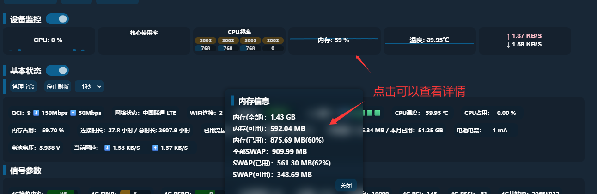

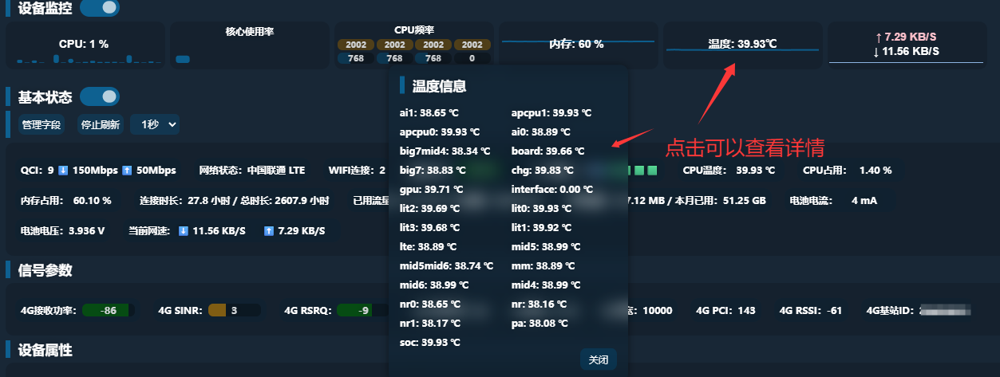

### 6.7 Battery and Power Information

If the device has battery and power information collection capabilities, the backend will display the following items:

- Battery Level
- Charging Status
- Battery Current
- Battery Voltage

This information is mainly used to assess the following:

- Whether the device is currently charging
- Whether battery level is sufficient
- Whether power supply is stable
- Whether there is abnormal power consumption

In long-running scenarios, focus on:

- Whether the battery level has been low for extended periods
- Whether current is fluctuating abnormally
- Whether the device is still losing charge even with external power

If the device is used for fixed deployment, long-term online operation, remote monitoring, or SMS forwarding, this information is especially worth long-term attention.

## 7. Network and Signal Management

### 7.1 Data Switch

> "Data Switch" is used to control the device's cellular data connection enable/disable.  
> This is one of the most basic network control items, suitable for temporarily disconnecting cellular data, switching environments, or troubleshooting connectivity issues.

Common usage scenarios include:

- Temporarily disabling mobile data connection
- Performing reset operations when troubleshooting connectivity issues
- Testing in combination with APN, network mode, or band/cell locking operations

Usage recommendations:

- If data switch is turned off, the device may still maintain LAN access but cannot continue internet access via cellular network
- If still unable to connect after re-enabling, continue checking APN, network mode, SIM status, and signal conditions
- Data switch toggles may sometimes not sync immediately. If status is out of sync, refresh the page

### 7.2 Network Mode Switching

Network mode switching controls which type of cellular network the device preferentially uses.  
Common available modes include:

- 5G/4G/3G
- 5G NSA
- 5G SA
- 4G/3G
- 4G Only
- 3G Only

Different modes are suitable for different scenarios:

- `5G/4G/3G`: Suitable for daily default use, balancing compatibility
- `5G NSA`: Suitable when testing NSA networking environments
- `5G SA`: Suitable when device and network both support SA and standalone 5G is preferred
- `4G/3G`: Suitable when 5G signal is unstable or frequent switching is undesirable
- `4G Only`: Suitable for pursuing stability or troubleshooting 5G access issues
- `3G Only`: Generally only used in special test scenarios

Recommendations:

- For daily use, start with auto or mixed mode
- If 5G signal is weak with fluctuating speeds, try switching to 4G Only to test stability
- After adjustment, verify with "Basic Status" and "Signal Parameters" that the switch was actually successful

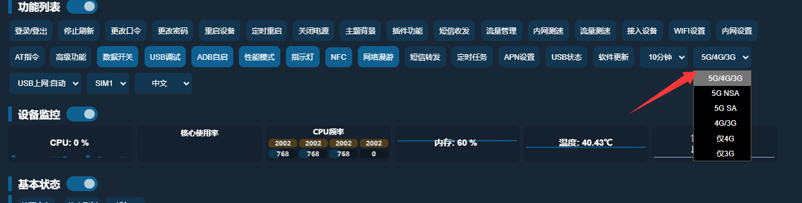

### 7.3 Band Locking

> "Band Locking" is used to restrict the device to work only on specified 4G or 5G bands.  
> This is an advanced network tuning feature, suitable for users familiar with bands, carriers, and local network conditions.

The band locking module provides:

- 4G band list
- 5G band list
- Frequency range for each band
- Technology information
- Carrier reference information

Common uses include:

- Testing whether a specific band has better coverage
- Preventing the device from frequently switching between multiple bands
- Testing specific band performance for fixed scenarios
- Improving stability in certain environments

Usage recommendations:

- If unfamiliar with bands, do not remove too many available bands at once
- Start by retaining a few commonly used bands and test incrementally
- When testing, observe signal parameters, current speed, and stability changes together

Risk notice:

- Locking the wrong band may result in no signal, weak signal, or inability to register on the network
- Different regions and carriers support different bands. Avoid copying others' configurations

To restore default state, use the "Unlock Band" feature.


### 7.4 Cell Locking

> "Cell Locking" is used to restrict the device connection to a specified cell or base station.  
> Compared to band locking, cell locking is a more advanced network debugging capability, suitable for use when familiar with signal parameter meanings.

The cell locking area includes:

- Locked cell list
- Current cell information
- Neighbor or candidate cell list
- Network type selection (4G / 5G)
- PCI and frequency input fields

The backend also provides:

- Select current cell
- Lock cell
- Unlock cell
- Stop refresh to lock multiple cells one by one

Common uses include:

- Fixing connection to a more stable cell
- Preventing the device from switching back and forth between multiple cells
- Testing the actual performance of a target cell
- Finer network optimization in combination with bands and signal parameters

Risk notice:

- Selecting the wrong cell may result in unstable signal, no signal, or inability to register
- After environmental changes, a previously suitable cell may no longer be appropriate
- Do not randomly lock cells without understanding PCI, frequency, and current network structure

Recommended operation:

- First observe the current cell and neighbor list
- First test current cell performance, then decide whether to lock
- Stop refresh before operating to avoid real-time parameter changes affecting selection

To restore default connection state, use the "Unlock Cell" feature.


### 7.5 APN Settings

> APN settings are used to configure the access point information the device uses to connect to the carrier data network.  
> In most cases, the device automatically matches the APN based on the SIM card; however, when the device cannot connect, certain cards cannot properly register for data services, or special network configuration is needed, adjustments can be made through this feature.

Current backend APN management includes:

- Current APN viewing
- Automatic APN mode
- Manual APN mode
- Profile viewing
- Add APN
- Modify APN
- Delete APN

Common fields when manually creating or modifying an APN:

- Profile name
- APN name
- Username
- Password
- Authentication method
- PDP type

Usage recommendations:

- If the device can connect normally, do not modify APN arbitrarily
- If unable to connect, first check whether the current APN matches the current carrier
- Before modifying APN, record the original configuration
- When unsure about parameters, consult the corresponding carrier first

APN errors may cause the device to:

- Be unable to connect to the internet
- Be unable to obtain data service
- Have abnormal network access but seemingly normal signal


### 7.6 Network Roaming

> "Network Roaming" controls whether the device is allowed to use roaming-related capabilities in specific network environments.  
> Whether this feature is effective depends on the device, SIM card, carrier policy, and current network environment.

Suitable scenarios include:

- Special network environment testing
- Network access attempts when used in different locations or across regions
- Auxiliary troubleshooting when certain cards cannot properly attach to the network in default state

Usage recommendations:

- If unfamiliar with the current card's roaming policy, do not switch randomly for extended periods
- If abnormal data usage, abnormal registration, or billing issues occur after enabling, restore immediately and verify carrier rules

### 7.7 LAN Speed Test

"LAN Speed Test" tests the device's transfer capability under the current LAN or backend proxy link, mainly used as a reference for local link performance.

LAN speed test supports:

- Setting test block size
- Start speed test
- Stop speed test
- Loop speed test
- Display current speed, average speed, total time, and download total

Suitable scenarios for LAN speed test:

- Testing device LAN access performance
- Roughly observing backend link performance changes
- Doing before/after comparisons with network mode, band/cell locking, and WiFi settings

Notes:

- LAN speed test results are mainly for reference and do not equal actual carrier public network speed
- When testing, avoid performing large data tasks simultaneously to prevent result interference
- LAN speed test does not consume carrier data


### 7.8 Data Speed Test

> "Data Speed Test" tests the actual download capability under cellular data connection.  
> Compared to LAN speed test, this feature is closer to the user's real internet scenario, but results are still affected by test address, thread count, proxy method, carrier, and current signal environment.

Includes the following:

- Test address
- Thread count
- Start speed test
- Loop speed test
- Real-time result display

Usage recommendations:

- Keep the device network environment stable before testing
- Do not perform large data downloads simultaneously during the speed test
- Speed test results should be assessed together with signal parameters, bands, current cell, and network mode
- Please use slightly larger file download links (e.g., download links from certain game clients)

Notes:

- It is explicitly noted that this speed test goes through LAN proxy forwarding; data is for reference only
- Due to proxy API limitations, single download duration may have a fixed upper limit
- If results are low, it may not fully represent actual public network capability; it could also be affected by the current test server or link limitations

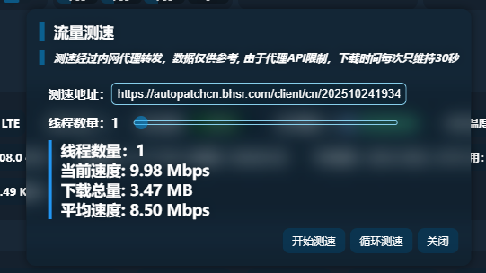

## 8. Communication and Debugging Features

### 8.1 SMS Send/Receive

> "SMS Send/Receive" is used to view the device SMS list, read new messages, and directly send SMS.  
> This is one of the commonly used communication features in UFI-TOOLS, suitable for verification code reception, device notification viewing, and basic SMS operations.

The SMS window contains the following core content:

- SMS list
- Recipient input field
- SMS content input field
- Send button

Usage method:

1. Click the "SMS Send/Receive" button.  
2. View existing messages in the SMS list.  
3. To send an SMS, enter the phone number in "Recipient."  
4. Fill in the content in "Enter SMS content."  
5. Click "Send."  

Applicable scenarios:

- Viewing verification code SMS
- Viewing carrier notification SMS
- Sending test SMS
- Handling notifications for numbers bound to the device

Usage recommendations:

- Confirm the phone number format is correct before sending
- If the SMS list does not update, check device network status and SMS permissions first
- If the device's SIM card does not support SMS services, this feature may not work properly


### 8.2 SMS Forwarding and Device Info Notifications

> "SMS Forwarding" is used to automatically forward SMS content to a specified destination when a new message is received.  
> This feature is suitable for remotely receiving verification codes, unified notification SMS collection, unmanned device management, and similar scenarios.

"Device Info Notification" means that when "SMS Forwarding" is enabled, device-related information can be pushed based on power status or in combination with scheduled tasks.
Related information includes:

| Category | Content |
| -------- | ------- |
| Data Usage Info | Daily data usage, monthly data |
| CPU Status | CPU usage, CPU temperature |
| System Resources | Memory usage |
| Device Info | Software version, device model |
| Power Info | Battery and power supply information |
| Operating Status | Uptime |

The SMS forwarding module includes the following main capabilities:

| Category | Content |
| -------- | ------- |
| Basic Control | Master switch |
| Forwarding Config | Forwarding rules, simultaneously forward device info |
| Notification Type | Power status notifications |
| Forwarding Methods | SMTP forwarding, CURL forwarding, DingTalk forwarding |

Supported forwarding methods:

- `SMTP method`: Forward SMS to a specified email
- `CURL method`: Forward to Telegram, Enterprise WeChat, PushPlus, Bark, etc. via custom requests
- `DingTalk method`: Forward via DingTalk robot Webhook

Supported SMS forwarding placeholders include:

- `{{sms-body}}`
- `{{sms-time}}`
- `{{sms-from}}`

Device information can also be forwarded along, such as:

| Variable | Description |
| -------- | ----------- |
| `{{daily-flow}}` | Today's data usage (Android statistics) |
| `{{cpu-temp}}` | CPU temperature |
| `{{cpu-usage}}` | CPU usage rate |
| `{{mem-usage}}` | Memory usage rate |
| `{{battery-level}}` | Battery level |
| `{{battery-current}}` | Battery current |
| `{{battery-voltage}}` | Battery voltage |
| `{{model}}` | Device model |
| `{{monthly-flow-count}}` | Monthly data (Android statistics) |
| `{{app-ver}}` | UFI-TOOLS version |
| `{{monthly-flow-sum}}` | Monthly cumulative data (factory backend statistics) |

Usage recommendations:

- Configure one forwarding method first and verify it works before adding complex rules
- When used for verification code reception, test that messages arrive reliably first
- If "simultaneously forward device info" is enabled, messages will be richer but also longer
- When configuring CURL, the entire command must be kept on a single line without line breaks

Example CURL script for forwarding to Enterprise WeChat:

```shell
curl -X POST "https://qyapi.weixin.qq.com/cgi-bin/webhook/send?key=xxxxxxxx" -H "Content-Type: application/json" -d '{"msgtype": "text", "text": {"content": "【Number】{{sms-from}}\n【SMS Content】\n{{sms-body}}\n【Time】{{sms-time}}\n【Daily Data】{{daily-flow}}\n【Monthly Data (Advanced)】{{monthly-flow-count}} \n【Monthly Data (Official)】{{monthly-flow-sum}}\n【CPU Temp】{{cpu-temp}}\n【CPU Usage】{{cpu-usage}}\n【Memory Usage】{{mem-usage}}\n【Software Version】{{app-ver}} \n【Model】U30 Unicom \n【Uptime】{{boot-time}}"}}'
```

SMS forwarding also supports forwarding rules, including number blacklist and SMS keyword blacklist.
**Number blacklist: SMS from matching numbers will not be forwarded**
**SMS keyword blacklist: SMS containing matching keywords will not be forwarded**
Entry format: **One per line**

Risks and notes:

- Incorrect configuration will prevent SMS from being forwarded successfully
- Webhooks, tokens, email passwords, and other configurations should be kept secure
- If there are too many rules or content is too long, message readability may be affected


### 8.3 AT Commands

> "AT Commands" is used to send AT commands to the device's baseband.  
> This is an advanced debugging capability that can be used to read device information, query parameters, and perform certain network and baseband operations.

The AT command window contains the following parts:

- Custom AT command input field
- AT execution slot selection
- Quick command area
- Execution result display area

Quick commands include the following common operations:

- Query contracted speed
- Query IMEI
- Deep serial query
- Fill in IMEI change command
- Query baseband info
- Reboot baseband
- Query IMSI
- High-speed rail mode

Usage method:

1. Open the "AT Commands" window.  
2. Select the AT execution slot.  
3. Enter a command starting with `AT+`, or directly click a quick command.  
4. View the execution result.  

Important notes:

- Custom AT commands are high-risk operations
- Entering incorrect commands may cause network anomalies, feature anomalies, or device state anomalies
- Users with embedded SIM cards or IoT cards should not arbitrarily execute IMEI modification-related operations

This documentation must clearly remind users:

- Only execute commands when you clearly understand their meaning
- First execute read-only query commands, then try modification commands
- Any write, IMEI change, or reboot commands should be used with caution


### 8.4 USB Debugging

> "USB Debugging" is used to control the device debugging interface status. It is an important prerequisite for subsequent advanced maintenance, update installation, wireless ADB, and custom debugging operations.

**Note: If you have enabled "Advanced Features," USB debugging becomes optional since everything USB debugging can do can also be done by "Advanced Features."**

The main purposes of this feature include:

- Providing a basic entry point for subsequent debugging operations
- Working in conjunction with software update features
- Working with network ADB, custom maintenance, and some advanced features

Usage recommendations:

- Only enable when debugging, maintenance, installation, or updates are needed
- Can be disabled when not in use to reduce exposure
- If certain features indicate they depend on debugging capability, check this switch status first

Security reminder:

- Enabling USB debugging increases device operability
- In public or uncontrolled environments, enabling debugging capabilities increases security risk

### 8.5 Network ADB Auto-Start

"ADB Auto-Start" controls the automatic enablement of wireless ADB or network ADB. When enabled, wireless ADB debugging will be automatically activated the next time the device starts.  
This feature is suitable for scenarios requiring remote maintenance, automatic recovery of debugging capability, or working with advanced features or software updates.

Interface information related to this feature includes:

- Network ADB status
- USB debugging switch status
- Firmware version
- Enable wireless ADB port
- Disable wireless ADB port

Purpose:

- After device reboot, the system can automatically activate network ADB
- Convenient for remote device maintenance without manually re-enabling each time
- Closely associated with software updates, AT capabilities, and developer-related features

Usage recommendations:

- Only enable when remote maintenance is clearly needed
- After enabling, pay attention to whether the network environment is secure
- If auto-enablement fails, check USB debugging status, device network status, and firmware compatibility first

### 8.6 TTYD Terminal

> TTYD is a web terminal capability provided by UFI-TOOLS Advanced Features.  
> After enabling advanced features and refreshing the webpage, users can access the terminal page through a browser to perform command-line level maintenance operations on the device.

TTYD purposes include:

- Remote device terminal access
- Executing scripts, viewing status, performing maintenance
- System-level operations in conjunction with advanced features

Important notes:

- TTYD is directly related to advanced features
- After enabling, a terminal access entry will be opened
- Default port is `1146`
- Accessing TTYD requires the UFI-TOOLS device passcode
- Password input is silent (no characters displayed during entry)

If you use a plugin to hide TTYD, it will not be displayed on the UFI-TOOLS webpage, but it is still accessible via port 1146.
If you want to restore TTYD visibility on the webpage:
1. Uninstall the TTYD-hiding plugin, then clear browser cache to restore
2. Uninstall the TTYD-hiding plugin, triple-click the UFI-TOOLS title area on the webpage, and click "Reset TTYD Port" to restore.

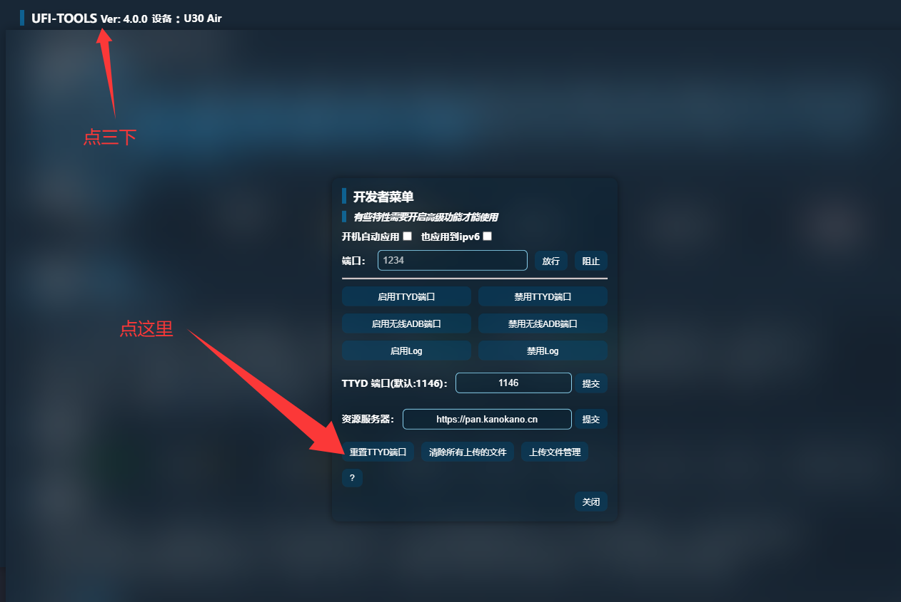

Usage recommendations:

- Only enable when command-line maintenance is needed
- After changing the port, record the new access address
- If the device is in a remote environment, confirm access control and network security policies first

Security reminder:

- TTYD is a high-privilege entry point
- Exposing it to an insecure network environment may pose serious risks


## 9. System and Device Controls

### 9.1 Performance Mode

> "Performance Mode" adjusts the device's operating strategy, making trade-offs between performance, power consumption, and heat generation.  
> This feature is suitable for speed testing, long-duration operation, light-load usage, or high-load processing, to be switched as needed.

Suitable scenarios for enabling performance mode:

- Need higher network processing capability
- Need faster backend operation response
- Performing speed tests, band/cell locking tests, or plugin testing
- Need to run transparent proxy software, firewall software, ad blocking software, NAS software, or other loaded scenarios

Usage recommendations:

- High-performance settings will bring higher heat and power consumption
- During extended high-load operation, monitor CPU temperature and power supply status
- If device cooling conditions are poor, do not run at high load for extended periods

### 9.2 LED Indicator Control

> "LED Indicator" controls the device's external status light display behavior.  
> This feature is suitable for nighttime use, fixed deployments, or scenarios where reduced visibility is needed.

Suitable scenarios for LED indicator control:

- Reducing light interference in nighttime environments
- Reducing visual exposure in fixed deployment scenarios
- Deciding whether to keep status light indicators based on usage habits

Usage recommendations:

- After turning off indicators, device status changes can no longer be directly observed via lights
- When on-site assessment of connectivity or charging status is needed, it is recommended to keep indicator functionality

### 9.3 NFC Control

> "NFC" controls device NFC-related functions.  
> Whether this feature is effective depends on whether the device hardware has NFC capability and whether the current firmware supports it.

Suitable scenarios for NFC control:

- Need to disable unnecessary near-field communication functions
- For power saving or reducing feature exposure considerations
- Specific testing for models with NFC capability

Usage recommendations:

- If the device has no NFC hardware, this feature may have no practical effect
- After adjustment, observe device behavior changes to confirm effectiveness

### 9.4 File Sharing (SMB)

> "File Sharing" controls the device's file sharing capability.  
> This feature is associated with device local file access, LAN sharing, and advanced features. Disabling this may cause advanced features to malfunction.
> **Therefore, when the user enables advanced features, even if the user manually disables file sharing, UFI-TOOLS will automatically re-enable this feature on the next boot.**

File sharing is suitable for the following scenarios:

- Need to access device files within the LAN
- Need to exchange configuration files, scripts, or logs
- Need to work with advanced features for extended operations

Important notes:

- Some advanced features depend on file sharing status
- After enabling advanced features, do not arbitrarily disable file sharing, or related capabilities may stop working

Security recommendations:

- In remote access scenarios, do not expose the SMB port to the public internet
- After enabling, if sensitive files exist, implement your own access controls

### 9.5 Sleep Timer Settings

> "Sleep Timer Settings" controls the device's time strategy for entering sleep mode during idle state.  
> This feature only takes effect on models equipped with a battery.

Available options include:

- Never sleep
- 5 minutes
- 10 minutes
- 20 minutes
- 30 minutes
- 1 hour
- 2 hours

This feature balances power saving needs with online availability.

Usage recommendations:

- When the device needs to stay online for extended periods, select "Never sleep"
- When battery life is the priority, set a shorter sleep time
- When the device handles SMS forwarding, remote access, or automated tasks, avoid setting too short a sleep time

### 9.6 SIM Card Switching

"SIM Card Switching" switches the current card slot or line on multi-card devices or specific models.  
Display varies by model. Common options include:

- `SIM1`
- `SIM2`

On some models, the following may also be displayed:

- `China Mobile`
- `China Telecom`
- `China Unicom`
- `External`

Suitable scenarios for SIM switching:

- Testing different card slots or carrier lines
- Switching between primary and backup cards
- Network compatibility testing

Usage recommendations:

- After switching, observe whether network status, signal parameters, and APN change simultaneously
- If unable to connect after switching, check the corresponding card slot status, carrier configuration, and APN settings


### 9.7 USB Tethering Mode

"USB Tethering Mode" sets the protocol the device uses when outputting network connection via USB.  
Available options include:

- `USB Tethering: Auto`
- `RNDIS`
- `CDC-ECM`

This feature is suitable for the following scenarios:

- When the device connects to a computer, router, or other terminal via USB
- When testing different host system compatibility with USB network protocols
- When troubleshooting USB tethering recognition issues

Mode descriptions:

- `Auto`: The device automatically selects the appropriate method
- `RNDIS`: Suitable for the most common USB network sharing scenarios
- `CDC-ECM`: Suitable for specific systems or devices that require this protocol for compatibility

Usage recommendations:

- When unsure, use "Auto" first
- If the host cannot recognize USB network, try switching between RNDIS and CDC-ECM
- After switching, reconnect or re-identify the network device

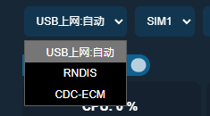

### 9.8 USB Status View

"USB Status" views the current Type-C or USB-related connection status.  
This feature assists with USB tethering mode, peripheral recognition, and debugging work.

Users can view through this window:

- Currently connected USB devices
- Connection recognition status
- Related interface information

Suitable scenarios:

- Troubleshooting USB tethering recognition issues
- Checking whether external devices are recognized by the system
- Assisting in confirming Type-C peripheral connection status


## 10. Local Network and Access Management

### 10.1 WiFi Settings

> "WiFi Settings" manages the device wireless hotspot's core parameters.  
> This module covers hotspot switch, band, name, security mode, password, and connection limit control.

Configurable content includes:

- WiFi switch status
- 2.4G / 5G band switching
- SSID
- Whether to broadcast SSID
- Security mode
- WiFi password
- Maximum connection count
- QR code

Security mode options include:

- `OPEN`
- `WPA2(AES)-PSK`
- `WPA3-PSK`
- `WPA2-PSK/WPA3-PSK`

Usage recommendations:

- When needing compatibility with more older devices, choose WPA2
- When needing higher security, choose WPA3 or mixed mode
- Do not use OPEN mode for extended periods
- WiFi password should be set to a sufficiently complex strong password
- Maximum connection count is actually limited by the system to a maximum of 10. You can use a Magisk module to remove the connection limit

Additional notes:

- WiFi band switching is an immediate modification item
- QR code can be used for convenient quick terminal connection to the current hotspot

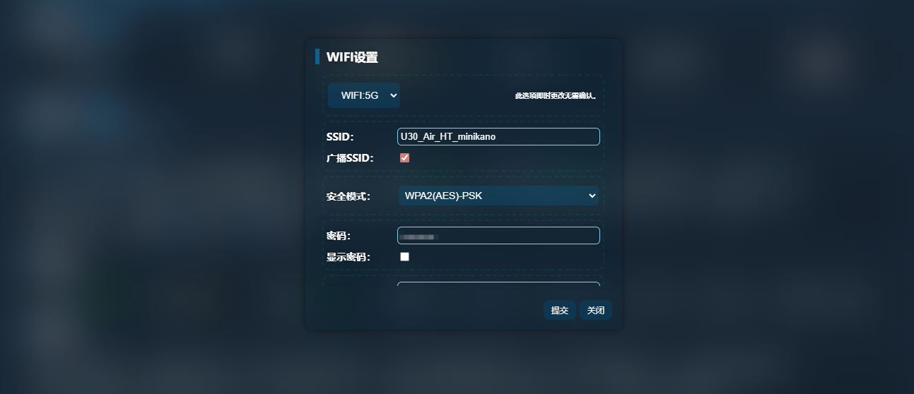

### 10.2 LAN Settings

> "LAN Settings" adjusts the device's LAN-side basic network parameters.  
> This module determines the backend access address, LAN address planning, and local network allocation strategy.

Configurable content includes:

- Gateway address
- Subnet mask
- DHCP switch

This feature is suitable for the following scenarios:

- Need to change the device's LAN address range
- Need to avoid conflicts with upstream network addresses
- Need to re-plan LAN terminal allocation range

Important notes:

- After modifying the gateway address, the backend access address will change accordingly
- If the browser cannot continue accessing after modification, use the new gateway address to re-enter the backend

For example:

- Pre-modification access address: `http://192.168.0.1:2333`
- If gateway is changed to `192.168.8.1`
- Post-modification access: `http://192.168.8.1:2333`


### 10.3 DHCP Settings

> DHCP settings control whether the device automatically assigns IP addresses to connected terminals, as well as the allocation range and lease time.

Configurable content includes:

- DHCP switch
- DHCP IP pool start address
- DHCP IP pool end address
- DHCP lease time

Usage recommendations:

- Keep DHCP enabled to reduce manual configuration work for regular terminal access
- If fixed address planning is needed, adjust the IP pool range as needed
- When setting the DHCP address pool, avoid conflicts with the gateway address
- When setting the address pool, avoid conflicts with already fixed-assigned addresses

DHCP is suitable for the following scenarios:

- Multiple terminals connecting to the hotspot and automatically obtaining addresses
- Unified LAN address range management
- Need to control the address allocation range for connected devices

Incorrect DHCP parameter settings may cause connected terminals to:

- Be unable to obtain an IP address
- Connect to the hotspot but be unable to access the network
- Conflict with existing addresses

### 10.4 Connected Device Management

> "Connected Device Management" views terminal information currently connected to the device hotspot or LAN.  
> This feature is suitable for identifying terminals consuming network resources, recognizing unknown devices, and managing LAN access.

> "Blacklist" is used to restrict specified terminals from continuing to access the current device network.  
> This feature is suitable when unknown terminals, abnormal terminals, or terminals that should not continue accessing are discovered.

The connected device list shows the following information:

- Host name
- MAC address
- IP address
- Connection type

Connection types include:

- Wireless
- Wired

Usage scenarios include:

- Viewing which terminals are currently connected to the device
- Determining whether unknown devices have connected
- Investigating terminal bandwidth usage in conjunction with data anomalies
- Verifying whether a specific terminal has successfully obtained an IP address

Blacklist supported operations include:

- Adding connected devices to the blacklist
- Unblocking devices already on the blacklist

Suitable scenarios for blacklist use:

- Unknown device detected connecting to the hotspot
- A terminal is consuming bandwidth for extended periods
- Need to temporarily block a terminal from accessing

Usage recommendations:

- Before blocking, confirm the target device's MAC address and IP address to avoid accidental blocking
- If a commonly used terminal is accidentally blacklisted, unblock it in the blacklist area
- Exercise extreme caution when operating on key maintenance terminals; avoid blacklisting your own management device

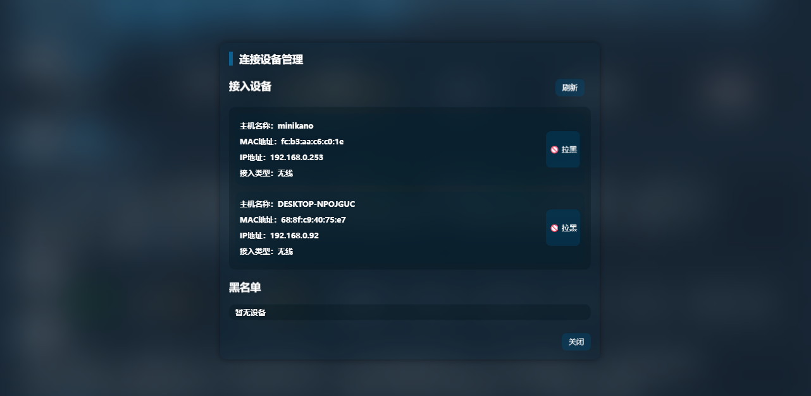

## 11. Data Usage and Automation Features

### 11.1 Data Usage Management

> "Data Usage Management" manages device data usage based on a plan-based approach.  
> This feature helps users record total quota, current usage, reset date, and alert threshold, providing notifications when approaching the threshold.
> Note: Incorrectly setting the alert threshold may cause the signal indicator light to flash red abnormally

Configurable content includes:

| Category | Content |
| -------- | ------- |
| Feature Switch | Whether to enable data management, whether to enable data reset |
| Plan Settings | Plan type, reset date, total data allowance, capacity unit |
| Usage & Alerts | Used data, alert threshold |

Supported capacity units include:

- MB
- GB
- TB
- PB

Usage recommendations:

- Set "Data Allowance" to the carrier plan's total quota
- Keep "Used Data" consistent with current actual usage
- Set "Reset Date" to the carrier plan's billing cycle date
- Set "Alert Threshold" to a suitable warning percentage for yourself, e.g., `80%`

Important notes:

- When data reaches the set threshold, the device will issue an alert
- If "Data Reset" is enabled, the system will reset statistics based on the set cycle

Suitable scenarios for data management:

- Plan has a clear monthly data cap
- Need to avoid exceeding data limits
- Need data controls for long-term deployed devices

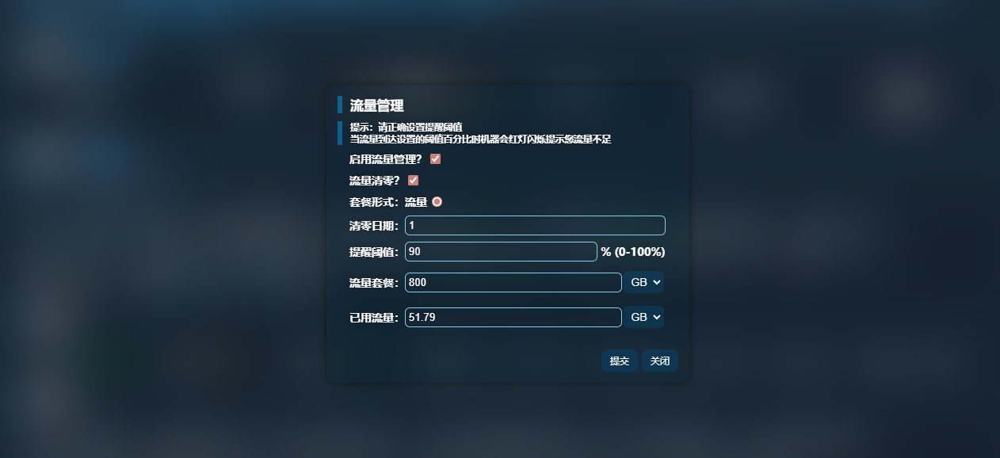

### 11.2 Scheduled Tasks

> "Scheduled Tasks" allows the device to automatically execute preset actions at specified times.  
> This feature automates repetitive operations, suitable for long-running devices and unmanned scenarios.

The scheduled task module includes the following main parts:

- Task list
- Add task
- Refresh tasks
- Delete or modify existing tasks

Task items contain the following key content:

- Task name
- Trigger time
- Whether to repeat
- Action parameters

Usage recommendations:

- Task names should be clear for easy distinction
- When there are many scheduled tasks, organize regularly to avoid duplicates or conflicts
- For actions involving network switching, reboots, or shutdowns, avoid peak usage hours

Suitable scenarios for scheduled tasks:

- Scheduled device reboot
- Scheduled network mode switching
- Scheduled WiFi on/off
- Scheduled data connection enable/disable
- Scheduled maintenance actions


### 11.3 Automated Action Descriptions

> When adding or editing scheduled tasks, the backend provides a set of action templates that can be directly entered.  
> These actions can be used to quickly generate task parameters and reduce manual input errors.

Currently available actions include:

| Category | Content |
| -------- | ------- |
| Communication & Notification | Forward device info, send SMS |
| System & Device | LED indicators, NFC, file sharing, performance mode |
| Network Control | Enable data, disable data, disable WiFi, enable WiFi (5G/2.4G), network roaming |
| Network Mode | Switch to 5G/4G/3G, 5G NSA, 5G SA, 4G Only |
| System Operations | Shutdown, reboot |
| Cell Control | Unlock cell, lock cell |
| SIM Management | Switch to SIM1, switch to SIM2, switch carrier (Mobile/Unicom/Telecom/External) |
| Debug Features | USB debugging |

Usage recommendations:

- Test a single action first before committing to long-term automated execution
- Tasks involving shutdown, reboot, cell locking, or SIM switching should be individually verified
- "Forward device info" depends on SMS forwarding configuration; complete SMS forwarding setup before use

Notes:

- Multiple scheduled tasks set at similar times may interfere with each other
- High-risk actions should not be triggered at high frequency
- After executing network-related task actions, observe whether the device recovers normal connectivity

Note that some task parameters need to be modified according to your actual situation. Tasks with invalid parameters will fail to execute.
Please familiarize yourself with JSON format before using the scheduled task feature.

For example, the action parameters for cell locking are:
```json
{
  "goformId": "CELL_LOCK",
  "pci": "912",
  "earfcn": "504990",
  "rat": "Fill in 16 for 5G lock, 12 for 4G lock"
}
```

The pci, earfcn, and rat parameters are user-defined and need to be filled in based on actual conditions.
Example:

```json
{
  "goformId": "CELL_LOCK",
  "pci": "113",
  "earfcn": "504990",
  "rat": "16"
}
```

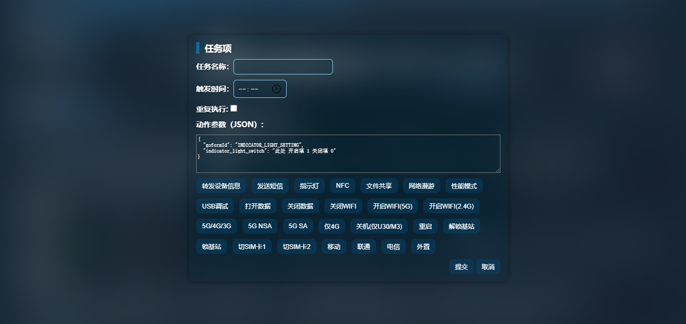

### 11.4 Boot Scripts and Scheduled Scripts

> UFI-TOOLS supports integration with post-boot automatic execution capabilities.  
> These capabilities allow the device to automatically restore certain configurations, ports, services, or user-defined logic after startup.
> Scheduled scripts can execute at a rate of once every 25-30 seconds.

**Boot scripts and scheduled scripts only take effect when advanced features are enabled.**

Boot script path: `/sdcard/ufi_tools_boot.sh`
Scheduled script path: `/sdcard/ufi_tools_schedule.sh`

Related capabilities include:

- Backend service boot auto-start
- Automatic restoration of certain feature states after startup
- Boot script editing
- Executing boot scripts in conjunction with advanced features

Suitable scenarios:

- Automatic service recovery after device power loss and restart
- Automatic restoration of remote maintenance entry
- Automatic restoration of certain fixed configurations
- Automatic execution of user maintenance scripts

Usage recommendations:

- Boot script content should be concise and clear; avoid adding too many high-risk commands
- Script content should be imported from external sources rather than written directly in the boot script
- Scripts should be kept one per line and use `nohup &` for background execution to prevent script blocking
- After each boot script modification, reboot the device to verify execution results
- If scripts affect connectivity, sharing, debugging, or system control, maintain recovery methods first

Risk notice:

- Boot script errors may cause feature anomalies or abnormal post-boot state
- Auto-recovery logic, if improperly configured, may repeatedly cause problems after each boot

## 12. Advanced Features

### 12.1 Advanced Features Introduction

> "Advanced Features" is a system-level extension capability provided by UFI-TOOLS for power users.  
> This feature adds deeper control entry points and stronger maintenance capabilities to the device.
> This is a signature feature of UFI-TOOLS.

Advanced features are suitable for the following users:

- Users who need remote device maintenance
- Users who need system-level debugging
- Users who need TTYD, boot scripts, or RootShell capabilities
- Users who need further extension and deep customization of the device
- Users who need to install and use various functional plugins

Not suitable for the following users:

- Users who only need basic connectivity and basic management features
- Users who do not understand the meaning and risks of related features
- Users who do not have recovery and troubleshooting capabilities

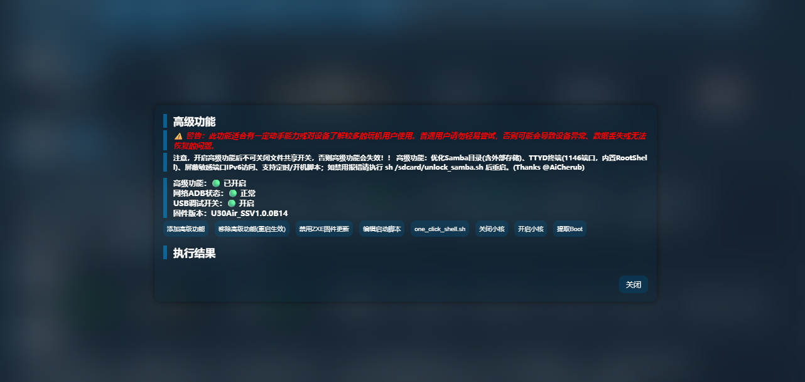

### 12.2 Activation Requirements

Before enabling advanced features, confirm the following conditions are met:

- Device-side installation has been completed
- Backend service is running normally
- Device network status is normal
- Current device and firmware version support this capability

The advanced features interface displays the following status information:

- Advanced features current status
- Network ADB status
- USB debugging switch status
- Firmware version

If activation fails, check the following issues first:

- Current firmware environment is incompatible
- System configuration was not written as expected
- Try factory resetting the device, then redeploy UFI-TOOLS

### 12.3 Feature Content

Current advanced features include the following capabilities:

| Category | Content |
| -------- | ------- |
| Files & Sharing | Optimized Samba directory, supports external storage access |
| Terminal & Shell | Provides TTYD terminal (default port `1146`), built-in RootShell, supports executing `quick_shell.sh` |
| Network & Security | Blocks sensitive port IPv6 access, supports disabling official firmware updates |
| Automation | Supports scheduled scripts, boot scripts |
| CPU Control | Supports disabling small cores, enabling small cores |
| System Maintenance | Supports Boot extraction |

Operation items in the advanced features interface include:

| Category | Content |
| -------- | ------- |
| Feature Management | Add advanced features, remove advanced features (effective after reboot) |
| System Control | Disable firmware updates, extract Boot |
| Scripts & Execution | Edit boot script, execute `quick_shell.sh` |
| CPU Control | Disable small cores, enable small cores |

Purposes of these capabilities:

| Feature | Description |
| ------- | ----------- |
| `TTYD` | Provides web terminal access entry |
| `RootShell` | Provides JS interface, granting JS command execution capability |
| Boot script | Automatically executes user maintenance logic after boot |
| Disable firmware updates | Prevents factory update mechanism from interfering with current environment |
| Small core control | Used for performance testing or special tuning |
| Boot extraction | Used for advanced backup and analysis |

### 12.4 Usage Precautions

When using advanced features, the following must be clearly understood:

- After enabling advanced features, do not disable file sharing
- If file sharing is disabled, advanced features may stop working
- After removing advanced features, some effects require a reboot to take effect
- Operations involving scripts, RootShell, TTYD, and Boot extraction are all high-risk operations

Risk notice:

- Improper operations may cause device anomalies
- Configuration errors may cause backend capabilities to fail
- Script errors may cause persistent device anomalies after boot
- Improperly exposing terminal entry points may pose security risks

Recovery tips:

- If advanced feature configuration is abnormal, execute as prompted:

`sh /sdcard/unlock_samba.sh`

Then reboot the device.

Usage recommendations:

- Back up important configurations before enabling
- Only adjust one high-risk item at a time
- After each system-level operation, verify that connectivity, backend access, and main features are working normally
- In remote environments, do not enable multiple high-risk options at once

## 13. Plugins and UI Customization

### 13.1 Plugin System Overview

> UFI-TOOLS provides an independent plugin feature for extending the backend page's display effects, interaction capabilities, and additional logic. The plugin system can supplement frontend features, add quick operations, adjust page behavior, or provide customization capabilities for specific use cases.

The plugin page displays plugin-related prompt information and provides unified management of plugin content, total size, and enable status. Plugin features are extension capabilities and are not required for basic connectivity.

Some plugins depend on advanced features. Without advanced features enabled, these plugins cannot work properly.

Plugins directly affect backend page behavior once loaded. Enabling plugins from unknown or unclear sources may cause page anomalies, feature conflicts, performance degradation, or security risks.

### 13.2 Plugin Add, Edit and Toggle

> The plugin management page supports adding, editing, enabling, disabling, sorting, and deleting plugins.

You can import plugin text files via "Add Plugin." The interface supports plugin file formats typically as `.txt`, but actually supports all text files, such as `.js`, `.html`. After import, the plugin enters the list, awaiting enablement or further editing.

**You can directly edit plugin content by clicking the plugin name.**

The plugin edit window supports directly modifying plugin content. Plugin content can include scripts, styles, and metadata. After modification, save and re-check whether the plugin works as expected.

The plugin list supports enabling and disabling individual plugins. When enabled, the plugin participates in backend page loading; when disabled, the plugin no longer injects into current page logic.

The plugin list supports drag-and-drop sorting. When multiple plugins are enabled simultaneously, order affects loading sequence. Plugins with dependency relationships or style override relationships should be ordered according to design requirements.

Before deleting a plugin, confirm that the plugin is not referenced by the current page, automation flows, or background resources.

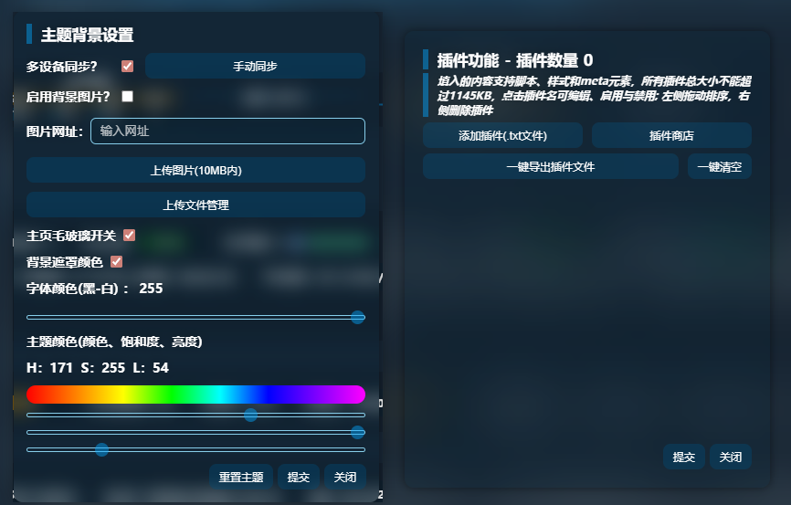

### 13.3 Plugin Store

> The plugin store is used to browse and install available plugins. The page supports search, paginated browsing, and plugin detail viewing.
> You can filter results by plugin name or keyword using the search box. Pagination buttons are used to switch between different plugin pages.
> Before installation, check the plugin description, applicable conditions, and dependency requirements.

The plugin store will prompt two types of important information:

- Some plugins depend on advanced features
- Plugins may affect device performance, page stability, or feature compatibility

Confirm the current device environment meets requirements before installation. After installation, immediately check whether the page opens normally and main features work properly.

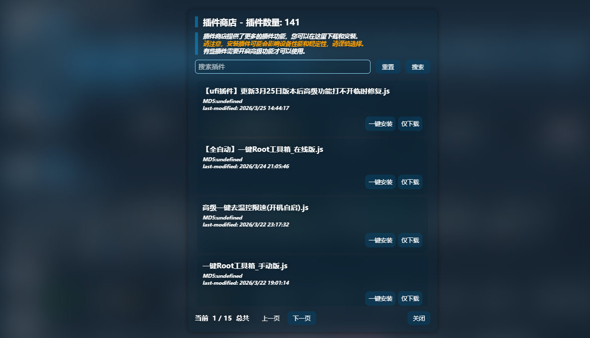

### 13.4 Plugin Import and Export

> Plugin management supports plugin import and export for backup, migration, and sharing.
> The export function exports current plugin content as a file for backing up existing configurations or migrating to other devices. Before batch adjustments, it is recommended to perform an export backup first.
> The import function adds external plugin files to the current plugin list. After import, check plugin names, content, and enable status to avoid importing the same plugin repeatedly.
> The page also provides a "Clear All" operation. After execution, the current plugin list is entirely cleared. This operation directly removes all added plugins. Before execution, confirm backup is complete; the actual clearing occurs after clicking submit.

### 13.5 Theme and Background Settings

> UFI-TOOLS provides theme and background settings for adjusting the backend page's visual style.

The theme/background settings page contains the following main items:

| Category | Content |
| -------- | ------- |
| Sync Features | Multi-device sync switch, manual sync button |
| Background Settings | Background image enable switch, background image URL input, local image upload, background blur switch, overlay color switch |
| Theme Adjustments | Text color, theme color, saturation, brightness, transparency adjustments |
| Operation Controls | Reset theme button |

When using background image URLs, ensure the image address is accessible long-term. When using locally uploaded images, control file size and confirm the image resource has been saved successfully.

After enabling background blur and overlay color, text readability can be improved. Text color, theme color, saturation, brightness, and transparency should be adjusted together to avoid interface contrast being too low or information being difficult to read.

"Reset Theme" restores current theme parameters to their initial state. When theme effects are abnormal, parameters are excessively layered, or page appearance is chaotic, use this feature to restore directly.
"Reset Theme" requires the multi-device sync feature to be enabled.

### 13.6 Uploaded File Management

> Theme backgrounds and some plugin capabilities use the uploaded file management feature to save resource files. This area is used for unified viewing and cleanup of uploaded content.
> Uploaded file management can be used to confirm whether resources have been successfully written, and to delete uploaded files that are no longer needed. After deleting uploaded files, background images, plugin content, or page resources referencing these files will immediately become invalid.

Before executing "Clear Uploaded Files," confirm:

- Current theme background does not reference these files
- Current plugins do not reference these files
- Local backups of resources that need to be retained have been completed

When resource management is disorganized, there are many duplicate uploads, or old files no longer serve a purpose, cleanup can be performed after confirming dependency relationships.


## 14. Software Updates and Remote Access

### 14.1 Software Updates
> UFI-TOOLS software updates are used to obtain new version features, bug fixes, and compatibility improvements. Before updating, confirm the current device is running stably and back up important configurations.

Each time the webpage is accessed, an update check is performed. If a new version is detected, a popup will notify the user.
Update notifications come in two types:
1. Normal notification: Normally notifies the user of a new version; the notification disappears after the user updates.
2. Persistent update notification: The update notification persists even after the user updates. This was designed to forcefully notify users to update software without changing the version number, to improve update rates.
Persistent update notifications will be manually cancelled by the maintainer on the server after some time.

Before updating, complete the following checks:

- Current backend is accessible normally
- Device network is working
- Current configuration items have been recorded or backed up
- Target version has been confirmed suitable for the current device and firmware environment

After updating, immediately check the following:

- Whether the backend homepage opens normally
- Whether login functionality works
- Whether network connectivity is normal
- Whether previously enabled key features still work
- Whether plugins and themes remain compatible

**Note: Please keep the device powered normally during the update process. Do not disconnect device power during updates.**
**If you manually disconnected power and find that the UFI-TOOLS webpage cannot be opened after restart, simply re-run the UFI-TOOLS installation and deployment process to resume normal use. Backend data is generally not lost in most cases.**

For devices involving advanced features, plugins, scripts, or custom configurations, each item must be verified after updating. If anomalies are discovered, stop making further adjustments and roll back to a working configuration or redeploy a confirmed working version.

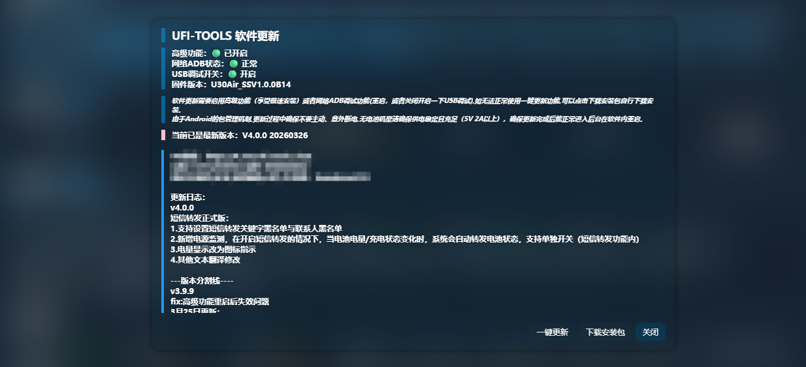

### 14.2 Remote Access to UFI-TOOLS
> Remote access is used to access the UFI-TOOLS backend from outside the same LAN. This feature is suitable for remote maintenance, viewing device status from another location, and performing limited control.

Before establishing remote access, confirm the following:

- The device has usable external network connectivity
- The access link has been correctly configured
- Login passcode and backend password have been changed to secure values
- Exposed ports, access entry points, and authorization scope are clearly defined

Remote access can be achieved through port mapping, reverse proxy, VPN, or other controlled links. Regardless of the method used, access sources must be restricted, and the backend should not be directly exposed to uncontrolled public network environments.

After enabling remote access, focus on controlling the following risks:

- Unauthorized access
- Weak passcode being guessed
- Debugging capabilities being remotely abused
- High-risk features being accidentally operated

Devices involving `TTYD`, network ADB, advanced features, plugin management, and system control should not be directly opened to untrusted access sources. After remote maintenance is complete, promptly close remote entry points that are no longer needed.

It is recommended to use the remote networking plugins `EasyTier` and `Tailscale` for remote management (available in the plugin store).

## 15. FAQ and Troubleshooting

### 15.1 Cannot Access Backend
> When unable to access the backend, first confirm whether the access address is correct. UFI-TOOLS' default access address is:
> `http://Device-Gateway-IP:2333`

Troubleshooting order:

1. Confirm the device has booted and is in normal operating state.
2. Confirm the backend service has started (you can use Scrcpy screen mirroring to check service startup status).
3. Confirm the access terminal and device network are reachable.
5. Confirm the access port is still `2333`.
6. Confirm the browser has not cached an error page or been interfered with by proxy tools.

If LAN settings, DHCP configuration, or gateway address have been previously modified, re-confirm the device's current IP. If the page cannot be opened for a long time, restart the backend service first, then try accessing again.

If remote access fails, first verify that the backend can be opened normally in the device's local network environment, then check port mapping, reverse proxy, VPN, or other remote link configurations.

### 15.2 Cannot Login or Authentication Failure
When login fails, first distinguish whether it is a passcode error, password error, or mismatch between access mode and entered credentials.

Troubleshooting points:

- Confirm the entered login information corresponds to the current login method
- Confirm "login passcode" and "backend password" are not mixed up
- Confirm the input does not contain extra spaces
- Confirm browser auto-fill has not entered an old password
- Confirm the current backend page is not a cached old page

If multiple people share the device, first confirm whether anyone has recently modified the login information. Before login is recovered, do not continue performing high-risk operations or remote control operations.

**If the passcode has been modified but authentication consistently fails, use Scrcpy or other screen mirroring software to access the UFI-TOOLS app on the device, click "Stop Service" and then modify the login passcode.**
**If the official backend login password is wrong, use Scrcpy or other screen mirroring software to access Application Management, find ZTE Smart Web or ZteWebServer, and clear that app's data to reset the password.**


### 15.3 Some Features Unavailable
> When some features are unavailable, first confirm whether the feature depends on a specific device state, system permissions, or advanced feature support.

Key items to check:

- Whether the current device model and firmware support the feature
- Whether relevant permissions have been granted
- Whether the backend service is running completely
- Whether network status meets the feature's execution conditions
- Whether advanced features have been enabled
- Whether plugins have changed page logic or button behavior
- Whether SELinux has been disabled on the device; if not disabled, the backend will display "Device firmware not supported"

For example:

- `SMS Forwarding` depends on SMS capability and forwarding configuration
- `TTYD`, scripts, custom extension capabilities depend on advanced features
- `Network ADB`, `USB Debugging` depend on debugging capability being enabled
- `Band Locking`, `Cell Locking`, `APN` capabilities depend on device-side interface availability

If issues appear after enabling plugins, modifying themes, adjusting advanced features, or changing scripts, first disable the newly added content, then re-verify whether original features are restored.

### 15.4 Advanced Features Malfunction
When advanced features malfunction, first determine whether it is an activation failure, execution failure, or system behavior anomaly caused after activation.

Troubleshooting order:

1. Confirm the current device and firmware support advanced features.
2. Confirm related status items on the backend status page are normal.
3. Confirm file sharing has not been disabled.
4. Confirm no scripts, uploaded files, or related resources have been accidentally deleted recently.
5. Confirm no conflicting plugins or high-risk configuration changes have been made recently.

If anomalies occur after enabling advanced features, stop adding more modifications. For capabilities involving `RootShell`, boot scripts, small core control, and Boot extraction, roll back recent changes one by one to narrow down the problem scope.

If advanced feature anomalies are caused by file sharing-related configuration, execute the recovery command as prompted:
`sh /sdcard/unlock_samba.sh`

Reboot the device after execution, then re-check advanced feature status.

If the device has persistent anomalies, the backend is unusable, or all key features have failed, prioritize restoring to a usable state and stop testing high-risk capabilities.
If recovery is consistently impossible, seek help in the community or directly factory reset the device and redeploy the backend.

## 16. Appendix

### 16.1 Common Terminology
For ease of reading this manual, common terms used throughout are explained here:

- `UFI / MiFi`: Refers to the ZTE T760 series and related form-factor portable WiFi devices.
- `Web Backend`: Refers to the device management page accessed via browser.
- `Device IP`: Refers to the device's current address on the local network.
- `Gateway IP`: Refers to the device's LAN gateway address. In most access scenarios, the backend access address uses this address.
- `APN`: Access Point Name, used to define mobile data network access parameters.
- `ADB`: Android Debug Bridge, used for device debugging, command execution, and application management.
- `USB Debugging`: Android debugging capability entry, used to establish ADB connections via USB.
- `Network ADB`: ADB debugging connection established via network rather than USB.
- `AT Commands`: Device modem command interface, used to query or control network and communication status.
- `TTYD`: Web terminal service, allowing device command line access via browser.
- `RootShell`: Command execution environment with higher system privileges.
- `Plugin`: Additional content used to extend UFI-TOOLS page capabilities, interface effects, or interaction logic.
- `Advanced Features`: System-level extension capabilities provided by UFI-TOOLS.
- `DHCP`: Service for automatically assigning IP addresses on the LAN.
- `SIM Card Switching`: Switching the currently used SIM card when supported by the device.
- `Band Locking`: Restricting the device to work only on specified bands.
- `Cell Locking`: Restricting the device to preferentially connect to a specified base station or cell.

### 16.2 Default Addresses and Ports
UFI-TOOLS uses the following common access addresses and ports during operation:

- Web backend default access address: `http://Device-IP:2333`
- Web backend default port: `2333`
- TTYD default port: `1146`

When using these addresses and ports, note the following:

- After modifying LAN settings, gateway, or DHCP configuration, re-confirm the backend address.
- After enabling remote access, reverse proxy, or VPN, the external access entry may no longer directly use the default address.
- Before opening ports `2333`, `1146`, or debugging-related ports, complete password hardening and access control first.

If you modified ports or access paths during deployment, use the device's actual current configuration and update maintenance records accordingly.

### 16.3 Reference Links

Repository address: https://github.com/kanoqwq/UFI-TOOLS

The following resources can serve as references for UFI-TOOLS usage, deployment, and troubleshooting:

- `README.md` in the project repository
- UFI-TOOLS one-click installer related release notes or demo materials
- Plugin description pages in the plugin store
- Bilibili videos and Coolapk forum posts in the corresponding section

When reading reference materials, prioritize the current repository, current version, and current device environment. If historical screenshots, old documentation, or third-party reprints are inconsistent with the current version, defer to the current actual interface and current project documentation.

If this manual differs from the current software version, record the differences first, then supplement with revision notes based on the current version.
